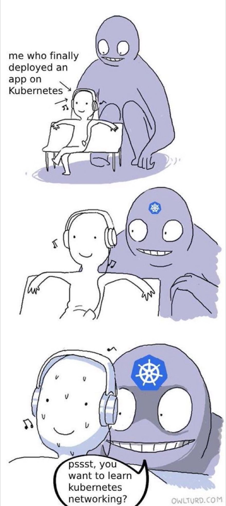

# 图文风格介绍容器网络

## 介绍

近年来，在 docker、K8S 流行后，很多运维、开发都是网上找教程跟风学 K8S，很多教程都是下面的大体步骤：

1. 搭建 K8S
2. 部署 deploy、一些简单应用
3. gitlab
4. jenkins
5. jenkins CICD K8S

而在处理一些容器网络相关问题和故障的时候，排查和定位手段有限，很难承担紧急问题救火的责任。

如果你属于下面的特征：

- （很多运维开发）不懂 iptables，每次出问题就是盲人摸象
- （很多运维开发）不懂 Docker 网络、K8S 的 CNI 网络
- 每天处理重复事情，遇到线上问题没有耐心钻研下去，随便网上搜几篇文章试试，碰对了就完事，事后不梳理故障处理过程和查缺补漏自己的弱项，导致技术一直原地踏步
- 自己技术薄弱，非上班时间从来不去补漏、折腾和学习，太复杂的教程又不想看

市面上也有深入讲解的，但是文字和代码居多的教程又太深奥了，本书以我个人当初小白到现在的经历、不少处理的故障的积累和帮助一些网友解决的问题经验总结的，以图文风格来简单讲解下这块儿。

## 感谢支持

[打赏](https://github.com/zhangguanzhang/simple-container-network-book/wiki/%E6%89%93%E8%B5%8F)

## 开始阅读

读者最好有 docker 和 K8S 的使用经历

- 您可以选择以下方式阅读本书：
  - [GitHub在线](./eBook/preface.md)

想读书的人，不会找不到 [目录](eBook/directory.md) :)
