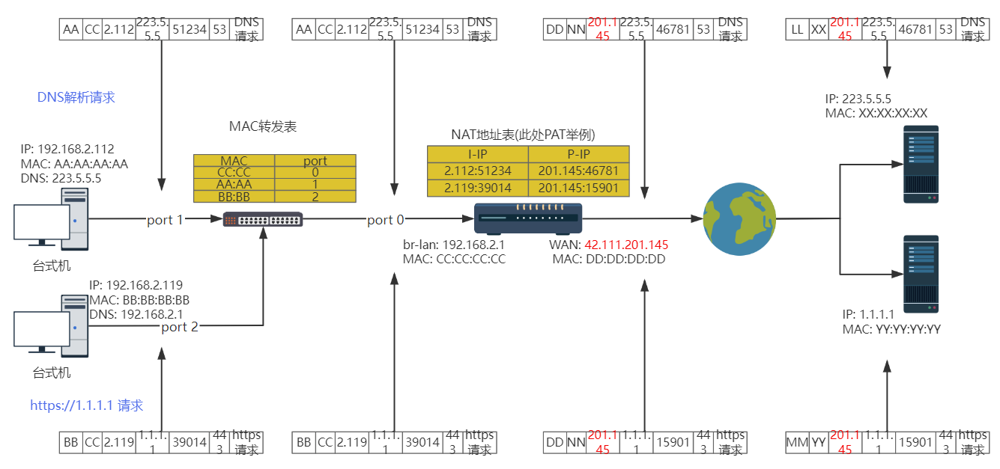

# 1.1 OSI 和网络

## OSI 网络模型

OSI 网络模型是国际标准化组织提出的一个网络互联抽象概念模型，并不实际存在，是为了在一个宏观而非细节的角度上，让人理解网络是如何运作的。

<table>
    <tr>
        <td>OSI 7层模型</td>
        <td>TCP/IP 五层模型</td>
        <td>作用</td>
        <td>示例协议</td>
    </tr>
    <tr>
        <td>应用层</td>
        <td rowspan="3">应用层</td>
        <td>与用户的交互而提供应用功能</td>
        <td rowspan="3">HTTP、FTP、SMTP、DNS、SSH、Telnet、MQTT...</td>
    </tr>
    <tr>
        <td>表示层</td>
        <td>数据的编码和解码</td>
    </tr>
    <tr>
        <td>会话层</td>
        <td>建立、维护、管理会话链接</td>
    </tr>
    <tr>
        <td>传输层</td>
        <td>传输层</td>
        <td>提供端到端的通信</td>
        <td>TCP、UDP、STCP</td>
    </tr>
    <tr>
        <td>网络层</td>
        <td>网络层</td>
        <td>路由和寻址</td>
        <td>IP、ICMP、OSPF、BGP</td>
    </tr>
    <tr>
        <td>数据链路层</td>
        <td>数据链路层</td>
        <td>传输数据帧</td>
        <td>FDDI、Ethernet、PPP</td>
    </tr>
    <tr>
        <td>物理层</td>
        <td>物理层</td>
        <td>将 bits 转换为电、无线电或光信号传输</td>
        <td>IEEE802、IEEE802.2</td>
    </tr>
</table>

## TCP/IP 网络模型

TCP/IP 五层或者四层模型是对于开发人员来讲的一个学习分层模型，每层的封装增加的信息为以下：

```
╭──────────────┬──────────────────────────────────────────────────────╮
│   应用层     │ 应用数据                                              │
├──────────────┼──────────────────────────────────────────────────────┤
│   传输层     │ TCP/UDP头部(其中有源目端口号) + 上一层的内容             │
├──────────────┼──────────────────────────────────────────────────────┤
│   网络层     │ IP头部（其中有源和目的IP地址） + 上一层内容              │
├──────────────┼──────────────────────────────────────────────────────┤
│   数据链路层  │ 以太网帧头（其中有源目MAC地址）+ 上一层内容 + 尾部的帧校验│
├──────────────┼──────────────────────────────────────────────────────┤
│   物理层      │ 把上一层内容按照每个比特位转换电信号或光信号            │
╰──────────────┴──────────────────────────────────────────────────────╯

```

假如本机 DNS 请求 `223.5.5.5` 解析 `www.baidu.com` 域名 IP 举例，大致封包过程如下：

```
# 根据机器上路由表，会选择从 eth0 192.168.2.112 网卡发送出去，分配的随机 client 端口为 51234 
╭──────────┬──────────────────────────────────────────────────────────────────────────────╮
│应用层     │                                        数据（www.baidu.com 的 IP 地址是多少） │
├──────────┼──────────────────────────────────────────────────────────────────────────────┤
│传输层     │                                                   UDP头部(51234|53)|数据     │
├──────────┼─────────────────────────────────────────────────────────────────────────────┤
│网络层     │                             IP头部(192.168.2.112|223.5.5.5)|UDP头部|数据     │
├───────────┼────────────────────────────────────────────────────────────────────────────┤
│数据链路层 │             以太网帧头(目标MAC地址|源MAC地址)|IP头部|UDP头部|数据|帧尾(CRC)    │
├───────────┼────────────────────────────────────────────────────────────────────────────┤
│物理层     │                             把上一层内容按照每个比特位转换电信号或光信号       │
╰───────────┴────────────────────────────────────────────────────────────────────────────╯
# 网络层发现 223.5.5.5 不在自己同一个二层内网，需要发往网关，会先发一次 arp 请求获取网关的 MAC
# 然后封装 数据链路层 里的目标 MAC 地址为网关地址
```

以下是结合网络设备的 TCP/IP 四层模型的流量图，现实中网络设备和多层的 NAT 暂不考虑，以下是一个简化的图：



在现实内部环境开发或者一些网络排查中，浏览器访问 URL 不通（通常来讲报错能反映一些问题，但是很多人都不会去看和思考），拿内网环境举例，一般的常见情况如下：
- 机器的端口没起来，也就是进程没起来或者没监听这个端口，或者 bind 错误了 IP
- 机器上防火墙没放行端口
- 网络报文没路由到该机器
- IP 冲突，arp 错误
- 机器没开机

很多时候作为一个开发你可能都无法 ssh 登录该机器（或者说其实也不用登录机器），最简单就是二分排查，也就是网络层到底可达没（不关注上层的端口 TCP/UDP 传输层），我们可以利用网络层的 ICMP 协议。也就是 ping 该机器的 IP，Linux 防火墙一般都会放行 ICMP 协议的（以及 Linux 内核参数默认是允许回复 icmp 请求的），所以可以先 ping 下，通了和不通都能说明接下来的排查方向：

```
╭──────────┬─────────────────────────────────────────────────────────────────╮
│网络层     │                    IP头部(192.168.2.112|223.5.5.5)|ICMP数据     │
├───────────┼────────────────────────────────────────────────────────────────┤
│数据链路层 │     以太网帧头(目标MAC地址|源MAC地址)|IP头部|ICMP数据|帧尾(CRC)    │
├───────────┼────────────────────────────────────────────────────────────────┤
│物理层     │                   把上一层内容按照每个比特位转换电信号或光信号     │
╰───────────┴────────────────────────────────────────────────────────────────╯
```

分层在排查网络和理解网络很有帮助，此外你需要知道 ARP、MAC、IP路由、子网、内外网、NAT 的大概作用，如果不知道会对后续的很多网络概念无法理解，不了解的请自行阅读下面推荐的教程。
而对于后面 K8S CNI（flannel，calico）的细致工作原理，你需要了解 VXLAN、IPIP、BGP 之类的隧道和路由协议。

## 一些教程

### 图文教程

- 大佬 `无聊的闪客` 公众号 [如果让你来设计网络](https://mp.weixin.qq.com/s/jiPMUk6zUdOY6eKxAjNDbQ) 文章，从两台机器互联到多台机器，衍生出二层三层协议的由来

### 视频动画教程

- [计算机网络-如何寻找目标计算机？](https://www.bilibili.com/video/BV1ho4y1j7qd/) 基于前面闪客大佬制作的视频动画
- [IP 地址不够用怎么办](https://www.bilibili.com/video/BV1Hu411W7T7) 讲解了为啥分 ABC 三类 IP 地址以及 NAT、NAPT 转换

### 扩展教程

- [内网穿透和NAT打洞是什么？](https://www.bilibili.com/video/BV19W4y1X7mV)

## 链接

- [前言](preface.md)
- 下一部分: [应用层以下的层](01.02.md)
