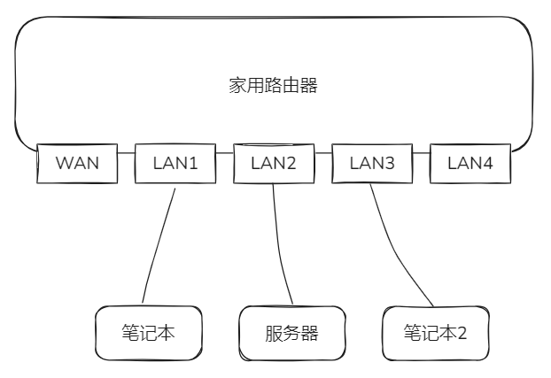
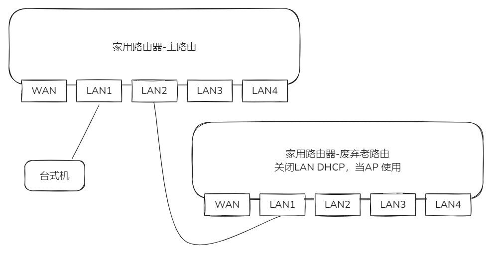

# 应用层以下的层

介绍一些网络相关排查命令，对于有些 Linux 命令 windows 上没有的可以考虑 windows 上安装个 git bash。

## 路由器

家庭路由器 =  LAN 口就是一个交换机 + AP（WIFI）+ 三层路由器 + 一些应用（DHCP、DNS、upnp ...）

你可以：
- 电脑，服务器，电脑三者连 LAN 口（LAN 是交换机）使用，配置 IP/MASK 不配置网关，局域网使用。

- 换下来（不支持一键 AP 设置）的老路由器可以关闭 DHCP ，LAN 口管理 IP 设置个主路由的不冲突的 IP， LAN 口连家里主路由器的 LAN 当 AP 使用（WIFI桥接延迟大概率会很高）或者扩展主路由的 LAN 口数量（例如有些主路由只有一个 LAN 口）。


而 AP 和 LAN 都是桥接在 br-lan 上的，作用相当于一根网线了，例如下面是从 Linux 角度来看：

```
$ brctl show
bridge name	bridge id		STP enabled	interfaces
br-lan		7fff.dcd87c280xxa	no		eth0
							phy1-ap0
							eth1
							eth2
							eth3
							phy0-ap0
```

地址信息：

```bash
$ ip a s 
1: lo: <LOOPBACK,UP,LOWER_UP> mtu 65536 qdisc noqueue state UNKNOWN group default qlen 1000
    link/loopback 00:00:00:00:00:00 brd 00:00:00:00:00:00
    inet 127.0.0.1/8 scope host lo
       valid_lft forever preferred_lft forever
    inet6 ::1/128 scope host proto kernel_lo 
       valid_lft forever preferred_lft forever
2: eth0: <BROADCAST,MULTICAST,UP,LOWER_UP> mtu 1500 qdisc mq master br-lan state UP group default qlen 1000
    link/ether dc:d8:7c:28:05:8a brd ff:ff:ff:ff:ff:ff
3: eth1: <NO-CARRIER,BROADCAST,MULTICAST,UP> mtu 1500 qdisc mq master br-lan state DOWN group default qlen 1000
    link/ether dc:d8:7d:28:05:8a brd ff:ff:ff:ff:ff:ff
4: eth2: <NO-CARRIER,BROADCAST,MULTICAST,UP> mtu 1500 qdisc mq master br-lan state DOWN group default qlen 1000
    link/ether dc:d8:7e:28:05:8a brd ff:ff:ff:ff:ff:ff
5: eth3: <NO-CARRIER,BROADCAST,MULTICAST,UP> mtu 1500 qdisc mq master br-lan state DOWN group default qlen 1000
    link/ether dc:d8:7e:28:05:8a brd ff:ff:ff:ff:ff:ff
6: eth4: <BROADCAST,MULTICAST,UP,LOWER_UP> mtu 1500 qdisc mq state UP group default qlen 1000
    link/ether dc:d8:7c:28:05:8b brd ff:ff:ff:ff:ff:ff
    inet 192.168.1.2/24 brd 192.168.1.255 scope global eth4
       valid_lft forever preferred_lft forever
7: br-lan: <BROADCAST,MULTICAST,UP,LOWER_UP> mtu 1500 qdisc noqueue state UP group default qlen 1000
    link/ether dc:d8:7c:28:05:8a brd ff:ff:ff:ff:ff:ff
    inet 192.168.0.1/24 brd 192.168.0.255 scope global br-lan
       valid_lft forever preferred_lft forever
8: phy1-ap0: <BROADCAST,MULTICAST,UP,LOWER_UP> mtu 1500 qdisc noqueue master br-lan state UP group default qlen 1000
    link/ether dc:d8:7c:28:05:8d brd ff:ff:ff:ff:ff:ff
    inet6 fe80::ded8:7cff:fe28:58d/64 scope link proto kernel_ll 
       valid_lft forever preferred_lft forever
9: phy0-ap0: <BROADCAST,MULTICAST,UP,LOWER_UP> mtu 1500 qdisc noqueue master br-lan state UP group default qlen 1000
    link/ether dc:d8:7c:28:05:8c brd ff:ff:ff:ff:ff:ff
    inet6 fe80::ded8:7cff:fe28:58c/64 scope link proto kernel_ll 
       valid_lft forever preferred_lft forever
$ ip route get 1
1.0.0.0 via 192.168.1.1 dev eth3 src 192.168.1.2 uid 0 
    cache
```

1.1 是光猫的 LAN 口 IP 地址，eth4 是 WAN 口，暂不讨论光猫改桥接。**如果在客户的网络中心内，不要乱接网线**。

## 协议和排查命令

### 二层 MAC

特别局域网内出现 IP 冲突时候，故障的机器无法上网，其他机器可以，多半是 IP 冲突，可以网关或者内网其他机器上查看 arp 表（存储 IP-MAC-NIC 映射记录）：

```bash
$ arp -n
IP address       HW type     Flags       HW address            Mask     Device
192.168.0.6      0x1         0x2         70:9c:xx:6f:xx:xx     *        br-lan
192.168.1.1      0x1         0x2         34:d8:xx:xx:06:xx     *        eth3
192.168.0.172    0x1         0x2         34:ea:34:xx:50:xx     *        br-lan
192.168.0.2      0x1         0x2         06:22:d2:xx:ca:xx     *        br-lan
192.168.0.141    0x1         0x0         70:9c:d1:xx:df:xx     *        br-lan
# 也可以 ip 命令
$ ip neighbour show
...
```

删掉一个指定条目：

```bash
arp --delete <IP_ADDRESS>
ip neighbour delete <ip_address> dev <interface_name>
```

### 三层 IP 层

TCP/IP 四层模型里，很多时候网络故障，都是先看最下层是否发生故障，例如家里上不了网了，可以：
- ping 网关 IP，确认 arp 、没有出现环路广播风暴和高延迟之类的
- ping 公网 IP，例如 `223.5.5.5`，`114.114.114.114` 从 2023 年开始很多地方 ping 不通了
- ping 公网域名检查 DNS
- curl -v 公网一个 http(s) url

当然，上层是下层承载着的，例如后续的 K8S 跨节点故障的时候，可以从应用层到下层逐步看：
- curl 非本机的 coredns 的 metrics web 接口 `:9153/metrics`
- ping 非本机的 `POD_IP`

实际生产环境中，最常见的就是利用（三层协议 ICMP） ping 看下 IP 可达不（Linux 系统防火墙和内核参数通常是允许被 ping 的），另外要注意，一些公共场所的 WIFI 之类的开了 AP 隔离，局域网除了网关以外互相无法访问。

#### IP

在一些例如 rescue mode Linux 里，要从外部拷贝文件，而不想去找怎么配置网卡，可以 ip 命令临时配置下：

```bash
# ip 命令是新趋势，功能十分强大，下面的都以 ip 命令举例
$ ip addr add 192.168.2.113/24 dev eth0
# ip addr del 192.168.2.113/24 dev eth0
```

这样同一个二层下其他机器就能和它可达了，或者 scp 二层其他机器上的文件，addr 其他子命令：

```bash
# 清空指定网卡上所有 IP
$ ip addr flush dev eth0
```

查看网卡 IP：

```bash
# ip a s 
$ ip addr show
$ ip addr show dev eth0
# 带颜色展示，选项也可以缩写
$ ip -color a s 
# json形式输出，-j 一些低版本 ip 命令上没有 json 选项
$ ip -json a s 
```

ip 命令的最常见的一些选项：
- -h：输出人类可读的统计信息和后缀，例如把单位转换成 M、G 之类的。
- -s：输出更多信息。如果该选项出现两次或更多，则信息量会增加。通常，信息是统计信息或一些时间值
- -d：输出详细信息
- -4：使用网络层协议是 ipv4 过滤
- -6：使用网络层协议是 ipv6 过滤

`ip subCmd1 subCmd2 help` 会打印帮助

另外要注意的是，一个网卡并不是只能有一个 IP，有多个 IP 很正常，在没有容器的时代都有这种场景。甚至网卡上的 IP 没有强制要求是 ABC 三类内网 IP，有些 IDC 把公网 IP 配置在网卡上很正常。

#### 路由

除此之外，还要注意机器上的路由表：

```bash
# ip 命令很多都可以缩写
$ ip route show
$ ip r s 
```

还有确认某个 IP 从哪个网卡走，出去的源 IP 是多少，`ip route get` 会帮你从 IP/MASK 计算，例如下面看默认路由：

```bash
# 等同于 ip route get 1.0.0.0
$ ip route get 1
# 包含了下一跳的 IP 地址，从 eth0 发出去，来源 IP 是 2.112
1.0.0.0 via 192.168.2.1 dev eth0 src 192.168.2.112 uid 0 
    cache 
```

当没有路由到你指定的 IP 地址的时候，会报错：

```bash
$ ip r g 1
RTNETLINK answers: Network unreachable
```

一般都是没有配置好默认路由造成的，可以添加默认路由：

```bash
$ ip route add default via 192.168.2.1 dev eth0
$ ip route del default via 192.168.2.1 dev eth0
```

也需要注意的是，多网卡一般和多路由配合，例如服务器八个网卡，接了 6 根线做三个 bond，给：

- 存储网：业务会使用 ceph rbd，10G 光口，专门的网络和交换机
- 业务网：业务流量，默认路由，10G 光口，专门的交换机
- 管理网：ssh 和管理使用，1G 电口，专门的交换机

这里暂不讨论非 main 路由表，具体见 `cat /etc/iproute2/rt_tables` 和 `ip rule`。

`ip route` 其他示例：

```bash
# 目标 IP 在 <net/mask> 的话发往 <ip> 去
$ ip route add <net/mask> via <ip>
```

#### 网卡

addr 子命令是针对网卡地址，而 link 子命令是针对链路层和网卡属性：

```bash
$ ip link show
```

##### 添加

添加

```bash
# 添加一个名为 kube-svc0 的 dummy 接口
$ ip link add kube-svc0 type dummy
# 添加一个网桥
$ ip link add xxx type bridge
$ ip link add xxx type veth ...
$ ip link add xxx type vxlan ...
$ ip link add xxx type vlan ...
$ ip link add xxx type gre ...
...
```

属性查看，例如查看 flannel.1 ：

```bash
$ ip -d link show flannel.1
150: flannel.1: <BROADCAST,MULTICAST,UP,LOWER_UP> mtu 1450 qdisc noqueue state UNKNOWN mode DEFAULT group default 
    link/ether 3a:b4:bd:ad:8b:8e brd ff:ff:ff:ff:ff:ff promiscuity 0 
    vxlan id 1 local 10.xxx.xx.xxx dev ens192 srcport 0 0 dstport 8472 nolearning ageing 300 noudpcsum noudp6zerocsumtx noudp6zerocsumrx addrgenmode eui64 numtxqueues 1 numrxqueues 1 gso_max_size 65536 gso_max_segs 65535
# 可以看到 vxlan 属性网卡 id 为 1，从哪个网卡出去，vxlan vtep 端口 8472
```

以及 up/down 网卡和设置属性：

```bash
# 由于 link 有 show 和 set ，所以不能缩写 s
$ ip link set xxx down/up
# 设置 eth0 混杂模式
$ ip link set eth0 promisc on/off
# 设置网卡队列长度
$ ip link set eth0 txqueuelen 1200
# 设置网卡最大传输单元
$ ip link set eth0 mtu 1450
# 修改网卡 MAC 地址
$ ip link set eth1 address 00:0c:29:f3:33:77
# 设置 eth0 桥接在 br0 下
$ ip link set eth0 master br0
...
```

查看网卡包的传输：

```bash
$ ip -h -s link show ens192
2: ens192: <BROADCAST,MULTICAST,UP,LOWER_UP> mtu 1500 qdisc mq state UP mode DEFAULT group default qlen 1000
    link/ether 00:50:56:99:xx:xx brd ff:ff:ff:ff:ff:ff
    RX: bytes  packets  errors  dropped overrun mcast   
    55.2G      108M     0       1.71M   0       2.37M   
    TX: bytes  packets  errors  dropped carrier collsns 
    3.63G      7.17M    0       0       0       0 

$ ip -s link show flannel.1
150: flannel.1: <BROADCAST,MULTICAST,UP,LOWER_UP> mtu 1450 qdisc noqueue state UNKNOWN mode DEFAULT group default 
    link/ether 3a:b4:bd:ad:8b:8e brd ff:ff:ff:ff:ff:ff
    RX: bytes  packets  errors  dropped overrun mcast   
    0          0        0       0       0       0       
    TX: bytes  packets  errors  dropped carrier collsns 
    xxx        xxxxx    0       8       0       0
```

例如上面的接收 RX 一直为空，最后排查到客户的 VPC 网络没有放行 udp 8472 端口造成 K8S 跨节点通信问题。


### 端口

一般没 nat 表的 NAT 规则，想查看监听端口，netstat 很多新发行版不自带了，使用更强大的 ss 命令：

```bash
# ss 很多选项和 netstat 一样
# -n 不反向解析，以纯 IP 数字形式展示
# -l, --listening 显示监听 IP 地址
# -p 输出进程信息，pid 和进程名
# -t 是 tcp -u 是 udp
$ ss -nlpt

# ss 还支持过滤表达式
$ ss -nlpt 'sport = 80'
# 显示统计信息
$ ss -s
```

除了端口以外，还要注意监听的 IP 地址，常规监听为以下几种情况，当然程序也可以自定义混合使用：

- `127.0.0.1` 不允许外部访问进来，只在本机提供访问。
- `单张网卡 IP`， 只允许这张网卡进来 
- `0.0.0.0` 监听所有网卡 IP

改内核参数绑定非本机 IP 暂不讨论。另外要注意的是 golang 一个在 netstat 下的特殊点：

```golang
package main

import (
	"net"
)

func main() {
	l, err := net.Listen("tcp", ":2000")
	if err != nil {
		log.Fatal(err)
	}
	defer l.Close()
	for {
		// Wait for a connection.
		conn, err := l.Accept()
		if err != nil {
			log.Fatal(err)
		}
		// Handle the connection in a new goroutine.
		// The loop then returns to accepting, so that
		// multiple connections may be served concurrently.
		go func(c net.Conn) {
			// Echo all incoming data.
			io.Copy(c, c)
			// Shut down the connection.
			c.Close()
		}(conn)
	}
}
```

以上代码 run 起来后，netstat 看到的 bind 的是 ipv6 ，实际是 ipv4 ipv6 都监听的，这是 golang 的一个小的显示问题。

```bash
$ netstat -nlpt | grep :2000
tcp6       0      0 :::2000                 :::*                    LISTEN      98822/main
```

#### tcp

很多时候不一定需要看 ping，特别是禁 ping 的时候，我们要检查远端端口是否可达，最常见的就是可以使用 telnet 协议，它在建立 TCP 握手后会维持一个类似 ssh 的虚拟终端：

```bash
# 退出交互可以 `ctrl + ]`
$ telnet 223.5.5.5 53
Trying 223.5.5.5...
Connected to 223.5.5.5.
Escape character is '^]'. <--- 出现这个代表 TCP 三次握手成功
```

但是某些系统上 telnet 并不会出现上面的 `]`，只要不是连接拒绝都会显示等待输入一样，可以尝试使用 [tcping](http://linuxco.de/tcping/tcping.html)，通过建立 TCP 链接，查看握手时间，代码层面做探测使用对应的 socket 库即可。

#### udp

由于 udp 是无状态协议，测 udp 端口时候需要登录到两台机器上，一般是看中间有设备拦截否，可以用 nc：

```bash
# 机器 1 起 server
$ nc -l -u 8472
# 机器 2 作为 client 发送到 server 上
$ nc -u <dest_public_ip> 8472
```

上面机器 2 上的 nc 交互窗口输入字符串回车后，server 上的 nc 窗口就能收到了。怀疑 udp 丢包或者带宽低可以用 `iperf3` 两台机器压测下。

## 链接

- [OSI 网络模型](01.01.md)
- 下一部分: [应用层常见排查命令](01.03.md)
