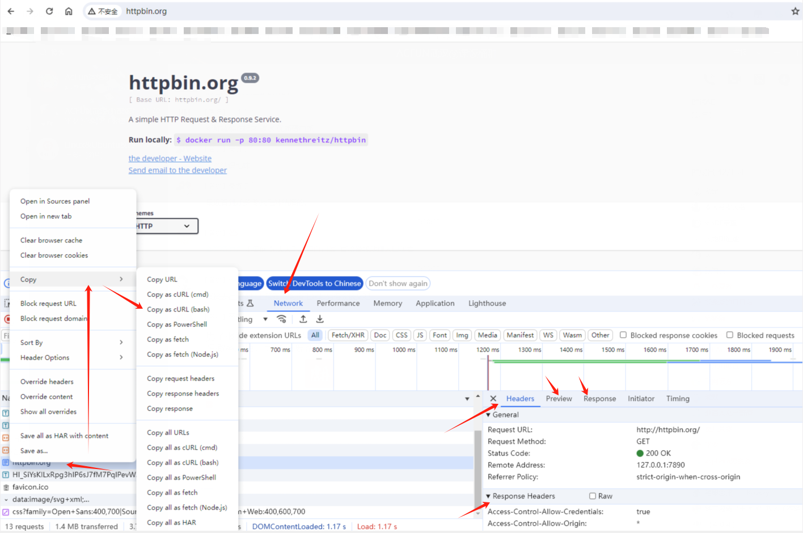
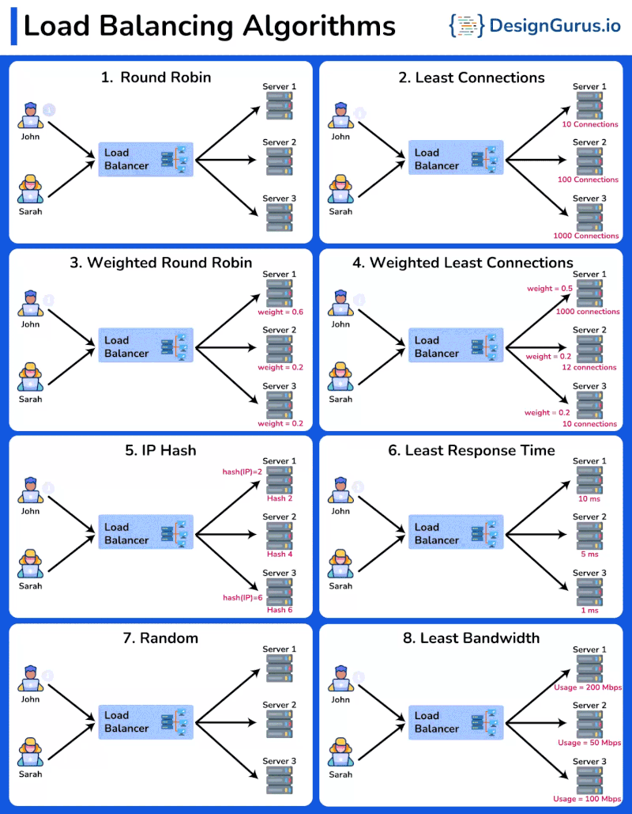

# 应用层常见排查命令

介绍一些应用层相关排查命令，对于有些 Linux 命令 windows 上没有的可以考虑 windows 上安装个 git bash。

## 应用层举例

再往上层来看，TCP/UDP 都是为了传输数据，也就是字节流，上层怎么解析这些流是应用层程序自己的行为（协议）。类比就像电话，只负责传递声音，而不在乎你是啥语言，TCP/UDP 职责把字节流传输过去。

### dns

Linux 上 DNS 相关配置就是 `/etc/resolv.conf` 文件里的 `nameserver` ，而里面所有可配置项目见 [man 手册页](https://man7.org/linux/man-pages/man5/resolv.conf.5.html) ，常见的就是下面的选项：

- nameserver，不要配置超过 3 个，见文章 [CentOS中resolv.conf的配置实验](https://linuxgeeks.github.io/2016/04/11/110119-CentOS%E4%B8%ADresolv.conf%E7%9A%84%E9%85%8D%E7%BD%AE%E5%AE%9E%E9%AA%8C/)
- search
- nodot
- 和一些常见的 options

此处讲解下 DNS 解析的一些常见命令说明：

#### nslookup

nslookup 分为交互和非交互模式，不带任何选项和参数执行就是交互模式，交互模式能力稍微强点：

```
$ nslookup www.baidu.com
Server:		127.0.0.53
Address:	127.0.0.53#53

Non-authoritative answer:
www.baidu.com	canonical name = www.a.shifen.com.
Name:	www.a.shifen.com
Address: 183.2.172.42
Name:	www.a.shifen.com
Address: 183.2.172.185
```

此处 DNS server IP 是 `127.0.0.53` 是因为有些 Linux 发行版会使用 `systemd-resolved` 在本机起一个 DNS server，通过命令来配置上游 DNS ：

```
$ cat /etc/resolv.conf
nameserver 127.0.0.53
options edns0 trust-ad
# 使用 resolvectl 命令查看
$ resolvectl -h
$ resolvectl  --no-pager status
$ resolvectl  --no-pager statistics
```

在一些 initContainer 里有些人喜欢做一些前置依赖检查 service 域名解析可用性，而早期 K8S 官方文档里推荐使用 `busybox:1.28` 里的 nslookup，后续有不少人发现升级 busybox 后无法解析了:

```bash
# busybox:1.28
$ nslookup kubernetes.default
Server:    10.96.0.10
Address 1: 10.96.0.10 kube-dns.kube-system.svc.cluster.local

Name:      kubernetes.default
Address 1: 10.96.0.1 kubernetes.default.svc.cluster.local

# busybox:1.31.1
$ nslookup kubernetes.default
Server:         10.96.0.10
Address:        10.96.0.10:53

** server can't find kubernetes.default: NXDOMAIN

*** Can't find kubernetes.default: No answer

command terminated with exit code 1
```

这个问题是见 issue [docker-library/busybox#48](https://github.com/docker-library/busybox/issues/48)，所以一般 DNS 排查过程中不推荐使用 nslookup 命令，但是只是简单解析的话，可以找个 glibc 镜像，使用以下黑科技：

```
# https://github.com/bitnami/containers/blob/main/bitnami/git/2/debian-12/prebuildfs/opt/bitnami/scripts/libnet.sh#L26
$ getent ahostsv4 kubernetes.default | awk '/STREAM/ {print $1;exit; }'
10.96.0.1
$ getent ahostsv4 kube-dns.kube-system | awk '/STREAM/ {print $1;exit; }'
10.96.0.10
```

#### dig

排查 DNS 问题建议使用更强大的 `dig @server name type` 命令，很多程序的 DNS 解析行为都是用的 glibc 提供的库，而避免因素干扰，dig 可以完全从命令行来指定 DNS 的解析逻辑：

```
# 使用默认的 DNS 解析
$ dig www.baidu.com

; <<>> DiG 9.16.48-Ubuntu <<>> www.baidu.com
;; global options: +cmd
;; Got answer:
;; ->>HEADER<<- opcode: QUERY, status: NOERROR, id: 21504
;; flags: qr rd ra; QUERY: 1, ANSWER: 3, AUTHORITY: 0, ADDITIONAL: 1

;; OPT PSEUDOSECTION:
; EDNS: version: 0, flags:; udp: 65494
;; QUESTION SECTION:
;www.baidu.com.			IN	A

;; ANSWER SECTION:
www.baidu.com.		60	IN	CNAME	www.a.shifen.com.
www.a.shifen.com.	59	IN	A	183.2.172.42
www.a.shifen.com.	59	IN	A	183.2.172.185

;; Query time: 0 msec
;; SERVER: 127.0.0.53#53(127.0.0.53)
;; WHEN: Mon Jul 15 14:53:38 CST 2024
;; MSG SIZE  rcvd: 101

# 简洁输出，缺省是查询 A 记录
$ dig +short baidu.com
39.156.66.10
110.242.68.66

# tcp dns 解析
$ dig +short +tcp baidu.com
# 使用指定 DNS 解析
$ dig @223.5.5.5 +short baidu.com

# 使用指定端口解析
$ dig @223.5.5.5 -p 53 baidu.com

# Pod 容器内使用 resolv.conf 里的 search 查找，因为默认行为是 +nosearch 的
$ dig +short kubernetes.default +search
```

例如宿主机上有 dig 命令，测试 coredns 能否解析：

```bash
$ dig @10.96.0.10 +short kubernetes.default.svc.cluster.local
# 或者绕过 svc，使用指定 coredns POD_IP 还不通就是 CNI 或者跨节点的问题
$ dig @<POD_IP> +short kubernetes.default.svc.cluster.local
```

dig 只介绍这些基础用法。另外不要在公有云 ECS 上自建 DNS Server，需要有相关备案资质才行，个人家庭内自建使用无所谓，但是很多人 ECS 上自建给自己家里和手机用是不符合相关规定的。

### ssh

ssh 卡住如何排查：

```bash
# ssh 提供 -v 参数，打印详细的信息，越多 v 信息越详细
$ ssh -vvvv xxx@xxxx
```

还有除去你添加过 pam 模块以外，可能是 sshd 配置问题，可以：

```bash
-r: Print elapsed time between system call starts (in the 2nd column in the output below)
-T: Print the elapsed times (durations) of syscalls (the rightmost fields like “<0.000364>”)
-f: Follow and trace child processes too
-p: Attach to PID 10635 and trace that
$ strace -r -T -f -p [sshd进程号]
```

### http

前面说了，TCP 实际就是传输数据的字节流，假设我们自己设计一个应用协议：

- 第一个字节（8bit）定义后面字节流的实际解码类型，例如 0 代表 raw 流例如文件，1 代表文字，2 代表图片...

然后开发一个聊天程序，底层就是 case 第一个字节，如果是 1，把后面的字节解码为字符到聊天对话里展示，2 就是图片。

```
 type := data[0]
 rec_data = data[1:-1]
 case uint8(type):
  0:
    file.WriteByte(rec_data)
  1:
    message.WriteConsole(rec_data)
  2:
    pic.Display(rec_data)
```

就此，你定义了一个应用层协议，然后发现这些不方便扩容，其实 http 协议和这个大致差不多，只不过它设计得没有这么粗制滥造，它的协议格式为下面三部分：

```bash
POST /submit-form HTTP/1.1 # 请求行执行的操作，如 GET、POST、PUT、DELETE。 URI 路径，HTTP 版本
Host: www.example.com # header，后端处理一般会忽略大小写
User-Agent: Mozilla/5.0 (Windows NT 10.0; Win64; x64)
Content-Type: application/x-www-form-urlencoded
Content-Length: 27

username=user&password=pass # body，和 header 里的 Content-Type 对应例如：text/html，image/jpeg。。。。
```

telnet 就是建立 TCP 后发送字符串，所以也可以模拟简单的 GET 请求：

```bash
$ telnet www.baidu.com 80
Trying 183.2.172.185...
Connected to www.a.shifen.com.
Escape character is '^]'.<---- 输入下面的后回车回车，因为 telnet \r\n 才是发送
GET / HTTP/1.1

.... <-- 百度的 http 回复
```

#### curl

当然，在面对更复杂的 http 接口排错时候，更多还是使用 curl 命令发送或者模拟 http 请求，curl 命令不单单是支持 http 协议，还支持其他协议，这里暂不讨论：

```
$ curl -V
curl 7.68.0 (x86_64-pc-linux-gnu) libcurl/7.68.0 OpenSSL/1.1.1f zlib/1.2.11 brotli/1.0.7 libidn2/2.2.0 libpsl/0.21.0 (+libidn2/2.2.0) libssh/0.9.3/openssl/zlib nghttp2/1.40.0 librtmp/2.3
Release-Date: 2020-01-08
Protocols: dict file ftp ftps gopher http https imap imaps ldap ldaps pop3 pop3s rtmp rtsp scp sftp smb smbs smtp smtps telnet tftp
# ↑ 这里是协议支持
Features: AsynchDNS brotli GSS-API HTTP2 HTTPS-proxy IDN IPv6 Kerberos Largefile libz NTLM NTLM_WB PSL SPNEGO SSL TLS-SRP UnixSockets
```

介绍下常见的 http 基础用法：

只看返回的头部，也就是 HEAD 请求：

```bash
$ curl -I http://httpbin.org
```

-v 选项打印详细信息，包含域名解析到的 IP，https 证书，发起的头部信息，然后接口 `http://httpbin.org/get` 会返回客户端的 header 信息：

```bash
$ curl -v http://httpbin.org/get
*   Trying 35.173.225.247:80...
* TCP_NODELAY set
* Connected to httpbin.org (35.173.225.247) port 80 (#0)
> GET /get HTTP/1.1
> Host: httpbin.org
> User-Agent: curl/7.68.0
> Accept: */*
> 
* Mark bundle as not supporting multiuse
< HTTP/1.1 200 OK
< Date: Mon, 15 Jul 2024 08:05:33 GMT
< Content-Type: application/json
< Content-Length: 254
< Connection: keep-alive
< Server: gunicorn/19.9.0
< Access-Control-Allow-Origin: *
< Access-Control-Allow-Credentials: true
< 
{
  "args": {}, 
  "headers": {
    "Accept": "*/*", 
    "Host": "httpbin.org", 
    "User-Agent": "curl/7.68.0", 
    "X-Amzn-Trace-Id": "Root=1-6694d84d-29cfb5b87bcaeb267f3b918f"
  }, 
  "origin": "178.xx.xx.xx", 
  "url": "http://httpbin.org/get"
}
```

`-H key: value` 设置 header ，例如：

```
$ curl  http://httpbin.org/get -H 'test: 11111111111111'
{
  "args": {}, 
  "headers": {
    "Accept": "*/*", 
    "Host": "httpbin.org", 
    "Test": "11111111111111", 
    "User-Agent": "curl/7.68.0", 
    "X-Amzn-Trace-Id": "Root=1-6694d921-0449f11d77d437e71b7113fc"
  }, 
  "origin": "178.236.xx.xx", 
  "url": "http://httpbin.org/get"
}
```

`-X method` ，例如发送 post 请求：

```bash
$ curl -XPOST  http://httpbin.org/post?a=123 --data-raw '{"key":"value"}'
{
  "args": {
    "a": "123"
  }, 
  "data": "", 
  "files": {}, 
  "form": {
    "{\"key\":\"value\"}": ""
  }, 
  "headers": {
    "Accept": "*/*", 
    "Content-Length": "15", 
    "Content-Type": "application/x-www-form-urlencoded", 
    "Host": "httpbin.org", 
    "User-Agent": "curl/7.68.0", 
    "X-Amzn-Trace-Id": "Root=1-6694d982-180db3df277a1ce879676d16"
  }, 
  "json": null, 
  "origin": "178.236.xx.xx", 
  "url": "http://httpbin.org/post?a=123"
}
```

一些其他常见选项：

- `-o file` 把 body 内容存到文件，下载文件时候使用
- `-k, --insecure` 允许非安全连接，通常 https 由非权威 ca 签署证书，例如 kubernetes 的接口，`curl -k https://10.96.0.1`
- `-L --location` 跟随重定向

而对于浏览器触发的请求，我们也可以 F12 network 里拷贝成 curl 命令格式，如下图：



然后更改一些参数 curl 发请求，调试后端逻辑之类的。需要注意的是，有些后端逻辑会有防重放防御，也就是一个 http 请求发送后，再发送就无效了。

`--resolve` 选项方便你来不修改 hosts 来指定域名的 IP ：

```
# curl --resolve <host:port:address> <URL>
$ curl --resolve example.com:80:127.0.0.1 http://example.com
```

一个要注意点的是，有时候后端逻辑会根据 `User-Agent` 做判断，浏览器看到的是 html 页面，curl 或者一些编程语言的 http 库请求后是 json 接口信息，当然不单单是 UA 字段。

还有有些网站避免爬虫，会利用浏览器的一些功能做人机校验，curl 是做不到那些的。

#### 故障排查案例

一个故障排查案例，群友在 K8S 里部署了 jenkins，设置的插件源为 https 清华源，安装插件报错：

```
unable to find valid certifacation path to reuqested target
```

这种一般是证书相关，非权威机构签署的假证书，当时比较忙，没时间帮他看，聊天和一些后续对话总结出来他环境的一些奇怪信息：
- 设置的源是清华的 https 源，不应该是非权威 https 证书
- 机器上和网关以及宿主机都没代理和透明代理
- jenkins 镜像也是使用的官方的
- 后面还反馈说在 pod 日志里，发现其他域名也出现类似问题，例如 baidu.com
- K8S 宿主机是虚拟机，是下载的 qcow2 文件导入创建的虚机，后面从 ISO 安装的系统上搭建 K8S 就好了

发现这个问题很奇怪，就让他复现一套环境给我远程上去看了下，在 ingress nginx 的容器里：

```bash
$ curl -v https://www.baidu.com
*   Trying 173.255.194.134:443...
* Connected to www.baidu.com (173.255.194.134) port 443 (#0)
* ALPN, offering h2,http/1.1
* TLSv1.3 (OUT), TLS handshake, Client hello (1):
*   CAfile: /etc/ssl/certs/ca-certificates.crt
*   CApath: /etc/ssl/certs
* TLSv1.3 (IN), TLS handshake, Server hello (2):
* TLSv1.3 (IN), TLS handshake, Encrypted Extensions (8):
* TLSv1.3 (IN), TLS handshake, Certificate (11):
* TLSv1.2 (OUT), TlS alert, certificate expired (557)
* SSL certificate problem: certificate has expired
* Closing connection 0
* curl: (60) SSL certificate problem: certificate has expired
More details here: https://curl.se/docs/sslcerts.html

curl failed to verify the legitimacy of the server and therefore could notestablish a secure connection to it, To learn more about this situation andhow to fix it, please visit the web page mentioned above.
```

根据 curl 信息可以看到报错 https 证书过期，这个容器里的 curl -v 不够详细，于是 K8S 节点上 curl -v 发现又是正常的：

```bash
$ curl -v https://www.baidu.com
* About to connect() to www.baidu.com port 443 (#0)
*  Trying 180.101.50.242...
* Connected to www.baidu.com (180.101.50.242) port 443 (#0)
...
```

但是我细心的发现了这个解析 IP 和容器内不一样，不对劲，然后 K8S 节点上尝试：

```bash
$ curl -v --resolve www.baidu.com:443:173.255.194.134 https://www.baidu.com
* Added www.baidu.com:443:173.255.194.134 to DNS cache
* About to conenect() to www.baidu.com port 443 (#0)
*  Trying 173.255.194.134...
* Connected to www.baidu.com (173.255.194.134) port 443 (#0)
....
* Server certificate:
*       subject: CN=*.mytrafficmanagement.com
*       start date: Aug 10 23:39:33 2023 GMT
*       expire date: Nov 08 23:39:32 2023 GMT
...
```

也就是 DNS 解析问题，然后发现是 search 导致的：

```bash
$ cat /etc/resolv.conf
nameserver 192.168.122.1
nameserver 119.29.29.29
search com <-------- 这里
$ dig @192.168.122.1 +short www.baidu.com
www.a.shifen.com.
180.101.50.242
180.101.50.188
$ dig @119.29.29.29 +short www.baidu.com.com <----加上 search 域名
45.79.19.196
173.255.194.134 <---- 找到解析 IP 了
....
```

然后让去掉 K8S 节点上的 seach 后，重建下容器就好了，pod 拉起来的时候，如果是默认的 DNSPolicy 策略，会把宿主机的 search 和 options 追加到 POD 的容器内。

#### 负载均衡

负载均衡是一个统称，各个方面都可以利用负载均衡

##### 反向代理

实际的 http server 不是单点的，往往是好几台，前面有高性能反向代理服务器:

```
                                            +-------+
                                            |       |
                               -+---------->+  rs   |
                              /             +-------+
                             /    
                            /     
                           /                +-------+
+--------+                /                 |       |
| client +----------> proxy/VIP/LB -------->+  rs   |
+--------+                \                 +-------+
                           \    
                            \     
                             \              +-------+
                              ------------->+       |
                                            |  rs   |
                                            +-------+

```

例如常见使用 nginx 而是因为 nginx 是一款开源高性能的 7 层 HTTP 反向代理软件，Nginx 的优势之一是其采用 C 语言编写，在开源社区中得到了许多顶尖专家的优化，使得在处理反向代理请求时具有卓越的性能表现。

与直接使用某些 web 框架来处理请求相比，Nginx 通常能够实现更好的性能，尤其在对于高并发、请求处理和负载均衡的情况下表现出色。因此，许多架构设计会选择将 Nginx 用作反向代理服务器，以提高系统整体的性能和稳定性。

当然类比下，裁剪 Linux 内核和定制硬件，制作一款专门的硬件负载均衡拿去卖，例如 F5，而这样的负载均衡肯定有人性化网页配置，也就是管理功能，而管理网和业务流量肯定是分开的（例如两个网口或 bond），多网卡和多路由其实很常见。

而负载均衡相关算法借鉴下别人的图：



软硬件实现手段为：

- 云上 SLB 之类的
- 硬件 LB
- 软件负载均衡，nginx、haproxy、keepalived + haproxy、Envoy....
- 内核能力 lvs 之类的
- 以及网络设备配置 ospf 和服务器 lvs 结合
...

例如混合四层+应用层使用：

```
L1/L2 是 nginx、Envoy 之类 7 层代理
                           http proxy            +-------+
                                                 |       |
                           +---------+---------->+  rs   |
                           | +-----+ |           +-------+
                           | |     | |
                           | |  L1 | |
                           | +-----+ |           +-------+
+--------+   VIP or SLB    |         |           |       |
| client +---------------->+         +---------->+  rs   |
+--------+                 |         |           +-------+
                           | +-----+ |
                           | |     | |
                           | | L2  | |           +-------+
                           | +-----+ +---------->+       |
                           +---------+           |  rs   |
                                                 +-------+
```

##### 一些其他举例

除了应用多台机器上部署，负载均衡和类似的思想，在很多场景都可以用到：
- 机器的网口，例如两根网线做 bond，分别到两台交换机（交换机做堆叠）
- 避免业务流量影响，可能单独的管理网、存储网，也就是多网卡多路由很正常
- 服务器双电源
- DNS 负载均衡，例如谷歌的 8.8.8.8 使用了 anycast
- 数据库负载均衡：主从、分库
...

### 抓包

抓包工具提供了一种详细深入的网络通信分析方式，能够帮助识别和解决各种网络和通信问题，同时也有助于理解和优化网络性能和安全性。

#### tcpdump

命令格式 `tcpdump -nn -i <any|网卡名> [-w file.pcap] filter ` ：
- `-n` 关闭反向 DNS 解析，`-nn` 顺带把端口按照数字显示
- `-i` 指定网卡，any 表示所有网卡
- `-w` 写入文件，可以导入 wireshark 查看 `.pcap` 格式文件

输出常见选项：
- `-e` 输出数据链路层的头部信息，例如源目 MAC 地址
- `-v`、`-vv`、 `-vvv` 详细输出
- `tcpdump -D` 列出可用于抓包的接口。将会列出接口的数值编号和接口名，它们都可以用于 `-i` 后。
- `tcpdump -r xx.pcap` 读取抓包的文件。

表达式单元的逻辑符号 `and、&&、or、 || 、not、!`，使用括号 `()` 可以改变表达式的优先级，但需要注意的是括号会被 shell 解释，所以应该使用反斜线转义为 `\(\)`，在需要的时候，还需要包围在引号中。

一些示例：

```
# 抓 icmp 的 ping 包
$ tcpdump -nn -i any icmp

# 限定 host
$ tcpdump -nn -i any icmp and host 223.5.5.5

# -e、-i any 同时使用的时候，不会同时显示目标 MAC 地址
$ tcpdump -nn -i ens160 icmp and host 223.5.5.5

# 抓取 flannel.1 的 vxlan 网络内的 172.27.1.4:9153 的包
$ tcpdump -nn -i flannel.1 host 172.27.1.4 and port 9153 -vv

# 抓包并保存
$ tcpdump -nn -i any icmp and host 223.5.5.5 -w icmp.pcap
# 查看抓包文件
$ tcpdump -nn -r icmp.pcap
```

注意 tcpdump 4.99 开始默认抓包过程中就可以看到网卡名字了，但是包管理的版本都比较低，可以 [源码编译安装](https://www.tcpdump.org/#latest-releases) 或者使用一些容器里的高版本。

#### ptcpdump

[mozillazg/ptcpdump](https://github.com/mozillazg/ptcpdump) 是一个使用 eBPF 技术开发的、类 tcpdump 的网络抓包工具。它除了兼容 tcpdump 的常用命令行参数以及包过滤语法外， 还额外提供了以下特性：
- 在输出中记录和显示发送网络流量的进程、容器、Pod 信息。
- 支持对指定进程、容器以及 Pod 进行抓包
- 当在 Wireshark 中打开保存的 pcapng 文件时，将能够看到每个数据包对应的进程、容器、Pod 信息。

缺点是要求 `内核 >= 5.2`。

## 链接

- [应用层以下的层](01.02.md)
- 下一部分: [iptables基础](02.01.md)
