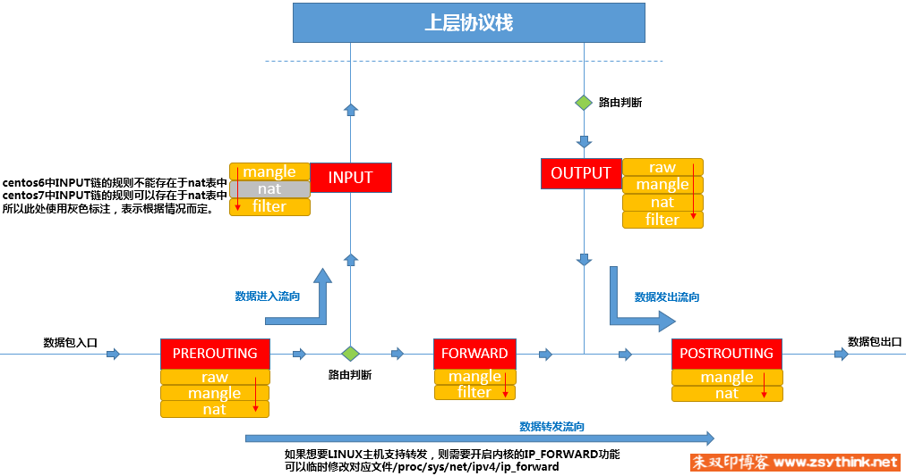

# 2.1 iptables

## iptables 和容器相关

Docker、K8S 和 CNI（flannel、calico 等等） 都使用了 iptables：
- docker 的 -p
- docker 桥接网络下容器访问外部网络
- K8S 的 Service
- pod 访问其他的 node IP 或者外部网络
- pod 的 hostPort
- NetworkPolicy

iptables 知识点非常广，全部讲解到的话是可以单独出一本书的，所以只介绍基础知识。

数据中心中有硬件防火墙，Linux 也有自己的防火墙，它就是 netfilter 安全框架，字面意思 “网络过滤” ，netfilter 处于内核空间，iptables 是命令行工具，我们用这个工具来增删改查 netfilter 提供的 hook 点上的规则（rule）。

## 如何学习 iptables

对于 iptables 基础教程，推荐先去看完 [朱双印 iptables 详解系列](https://www.zsythink.net/archives/1199)，看完后接着看下面的。



很多介绍 iptables 的文章都画了类似的图，虽然风格和位置不一样，但是核心都是是五链（netfilter 提供的 hook 点）五表（存储链的规则，对于匹配的包执行什么行为）：

- raw、mangle、nat、filter、security
- PREROUTING、FORWARD、INPUT、OUTPUT、POSTROUTING

五链总是有人记不住，这东西不能死记硬背，最简单的一个记忆方法根据网络情况记忆：
- 数据包进协议栈，和协议栈发包出去，就是 INPUT、OUTPUT
- Linux 有路由表，想到路由表，你就能想到路由前和路由后，也就是 PRE_ROUTING 、POST_ROUTING
- Linux 内核参数可以开启转发，开启后对于目标 IP 不是自己的可以转发出去。也就是 FORWARD

五表：
- filter： 过滤报文，例如 DROP、REJECT、ACCEPT，iptables 默认缺省的表，例如 iptables 操作规则时候默认就是 `iptables -t filter`
- nat: 地址转换， DNAT（POSTROUTING 做目标地址转换）和 SNAT （在 PREROUTING 做源地址转换）以及动态获取网卡 IP 做 SNAT 的 `MASQUERADE`
- raw：优先级最高的表，iptables 是有状态的，一般用 `-j NOTRACK` 关闭匹配包的链路追踪（connection tracking）提高性能和 CT （conntrack table）行为（-j CT --helper ftp）
- mangle：拆解报文，做出修改，并重新封装，例如 MTU、TTL、TOS，还有修改 MARK 来配合做策略路由，以及 tproxy 透明代理。
- security：后面新加的表，SELinux 相关安全使用

## iptables 常见概念和用法

写常见概念和用法是因为我的不少同事看完后没有去跟着实操验证，左耳进右耳出一样，在对于处理相关故障方面还是无从下手。

### iptables 常见知识点

#### 一些基础知识点

- Linux 的 firewalld 和 ufw 之类的关闭了，并不是代表 iptables 规则就不生效了，firewalld 和 ufw 只是更上层抽象后的易用和更丰富的一个管理工具，旨在减少对于底层的了解。这类防火墙默认策略都是拒绝的，所以很多人喜欢到手就关闭它们，有个要注意的点 `systemctl stop firewalld` 关闭 firewalld 会清空 iptables 规则，在运行 Docker 过程中停止 firewallld 会造成后续 `docker run -p` 报错 NO Chain 之类的。
- iptables 对规则增删改查会使用文件锁 `/run/xtables.lock`，可以使用 `-w/--wait` 选项避免竞争

#### iptables 常见命令

身边的同事和一些微信好友，哪怕看过 iptables，最后遇到 iptables 规则导致的问题的时候也是无从下手，本小节介绍一些 iptables 常见命令帮助你定位。

很多教程教查看 iptables 规则是：

```
iptables -nvL
iptables -nvL INPUT
```

这个非常不适合 iptables 新手阅读使用，而是应该 `iptables -S`：

```
$ iptables -S
-P INPUT ACCEPT
-P FORWARD DROP #<- 有些应用启动后，会把默认策略设置为 DROP，导致手动做转发的时候匹配到最后被DROP掉
-P OUTPUT ACCEPT
-N BASE-RULE
-A INPUT -p icmp -j ACCEPT
-A INPUT -m conntrack --ctstate RELATED,ESTABLISHED -j ACCEPT
-A INPUT -j BASE-RULE
-A FORWARD -j ACCEPT
-A BASE-RULE -i eth0 -m set ! --match-set whiteiplist src -m set --match-set whiteportlist dst -j DROP
-A BASE-RULE -j RETURN
...
```

该命令会输出 iptables 命令行风格的规则。假如外部无法访问上面机器的 80 端口，只能 ping 通，你会隐约感觉是 match-set 这条规则导致的，而假设该规则你又看不懂具体是干啥的，可以两个思路：

外面一台机器 `192.168.1.2` 频繁触发访问 80 端口：

1. 计数器
```
# 清空计数器
iptables --wait --zero INPUT
iptables --wait --zero BASE-RULE
# 观察计数器增加，看匹配到哪条链下的哪个规则
ipatbles --wait -nvL INPUT
ipatbles --wait -nvL BASE-RULE
```

2. 二分法，增加放行，例如

```
# 明细的来源 IP 和目标端口放行，特别是线上的时候
# insert 是最前面插入
iptables --wait --insert INPUT --source 192.168.1.2/32 -p tcp --dport 80 -j ACCEPT
# 外面能通了后删除该规则，也能 iptables --wait --delete INPUT 1 删除该规则
iptables --wait --delete INPUT --source 192.168.1.2/32 -p tcp --dport 80 -j ACCEPT

iptables --wait --insert INPUT 2 --source 192.168.1.2/32 -p tcp --dport 80 -j ACCEPT
iptables --wait --delete INPUT 2

iptables --wait --insert BASE-RULE --source 192.168.1.2/32 -p tcp --dport 80 -j ACCEPT
iptables --wait --delete BASE-RULE 1
...
```

最后以此内推，定位到是 `BASE-RULE` 链里的那个看不懂的规则，生产环境特别是部署了 K8S 后，`iptables -nvL` 的计数器会因为流量大而不容易观察，更多是后面说的二分法定位大概规则范围。

iptables 的规则就是 `匹配条件 行为`，下面列举一些规则：

```
# 使用 --insert 短选项 -I 和省略 --wait 举例了，实践的话最好找个能 tty 登录的机器以免失联，每个规则记得自行删除

# 放行 icmp 协议，让外面能ping 通本机
iptables -I INPUT --protocol icmp -j ACCEPT

# 从网卡 eth0 进来，来源 IP 是 192.168.1.0/24 的直接放行
iptables -I INPUT --in-interface eth0 --source 192.168.1.0/24 -j ACCEPT

# DNS 劫持，常见用于路由器上
# 例如路由器上运行了 5300 DNS server，这个 dns server 上游用 dns over http
iptables -t nat -I PREROUTING -p udp -m udp --dport 53 -j REDIRECT --to-ports 5300
iptables -t nat -I PREROUTING -p tcp -m tcp --dport 53 -j REDIRECT --to-ports 5300

# 劫持所有 1.1.1.1:53 的 DNS 请求并重定向到 223.5.5.5:53
iptables -t nat -A PREROUTING -d 1.1.1.1 -p udp --dport 53 -j DNAT --to-destination 223.5.5.5:53
iptables -t nat -A PREROUTING -d 1.1.1.1 -p tcp --dport 53 -j DNAT --to-destination 223.5.5.5:53

# 扔掉来源端口是 8082 的出去的 tcp 包
iptables -I OUTPUT -p tcp --sport 8082 -j DROP

# 下列是组合使用的
# 已经建立链接的直接放行
-A INPUT -m conntrack --ctstate RELATED,ESTABLISHED -j ACCEPT
# INPUT 链加了个BASE-RULE 链
-A INPUT -j BASE-RULE
# 表示从网卡 eth0 进来，来源 IP 不在 whiteiplist 的 ipset 里就 DROP
-A BASE-RULE -i eth0 -m set ! --match-set whiteiplist src -j DROP
# 符合了就继续往下一跳链走，会走到 RETURN，回到 INPUT 链
-A BASE-RULE -j RETURN
# 然后最后 INPUT 链默认策略是 ACCEPT，也就是 -P INPUT ACCEPT 上

```

最起码要先要学会看得懂 iptables 规则，熟悉了后就可以自己写规则了。

#### iptables 规则持久化

iptables 重启规则就会清空，所以如果不是程序添加的，人为手动添加的需要使用 `iptables.service` 之类的服务，例如下面的

```
yum install ipset ipset-service -y
sed -ri '/^IPSET_SAVE_ON_STOP=/s#no#yes#' /etc/sysconfig/ipset-config
systemctl enable --now ipset
vi /etc/sysconfig/iptables
systemctl enable iptables

# apt 系列 os
apt update && apt install -y ipset-persistent iptables-persistent
vi /etc/iptables/rules.v4
systemctl enable netfilter-persistent.service
```

## iptables 的两种模式

iptables 有两种模式：

1. `iptables-legacy`:
    - 这是传统的 iptables 实现，使用 xtables 进行扩展。
    - 通常用于早期的 Linux 内核版本。
2. `iptables-nft`:
    - 基于 nftables 实现的 iptables 命令。
    - nftables 是 Netfilter 项目的一部分，旨在简化和统一 Linux 防火墙和流量控制的配置。
    - 提供了与传统 iptables 类似的命令行接口，但其底层实现使用了 nftables，带来了更好的性能和灵活性。

模式可以通过 iptables -V 查看：

```
iptables v1.8.9 (nf_tables)
iptables v1.8.9 (legacy)
```

如果老版本的 Linux 发行版上面命令输出没有结尾的模式，都是 legacy 模式。 如果你不知道机器上两种模式规则都存在，在添加规则后会出现非预期的结果，是因为 `nf_tables` 优先级比 `legacy` 高，你如果执行 `iptables -S` 出现下面的：

```bash
$ iptables -S
# Warning: iptables-legacy tables presetn. use iptables-legacy to see them

# 可以单独查看模式的规则
iptables-legacy -S
iptables-nft -S
```

## 容器里使用 iptables

特别是容器里使用 iptables 避免和宿主机 iptables 模式不一致，可以像 [flannel](https://github.com/flannel-io/flannel/blob/8f480ccfb1319ef4fef9bc3a7abdc18286c6e3f1/images/Dockerfile#L20-L39) 那样使用下列仓库的编译整进去：

- https://github.com/kubernetes-sigs/iptables-wrappers

这个仓库主干分支是 golang 写的，之前的 v2 版本是脚本形式的的，例如可以下面这样：

```Dockerfile
FROM alpine:3.18
RUN set -eux; \
#    sed -i 's/dl-cdn.alpinelinux.org/mirrors.aliyun.com/g' /etc/apk/repositories; \
    apk add -u iptables  ipset  bash \
        --no-cache; \
    apk add --no-cache --virtual .curl \
        curl; \
    # 避免容器内和宿主机使用 iptables-nft iptables-legacy 模式不一致造成网络问题
    curl -L https://raw.githubusercontent.com/kubernetes-sigs/iptables-wrappers/v2/iptables-wrapper-installer.sh > /iptables-wrapper-installer.sh; \
    bash /iptables-wrapper-installer.sh --no-sanity-check; \
    apk del .curl; \
    rm -rf /var/cache/apk/* /tmp/*
...
```

另外如果容器纯粹操作 iptables 规则是不需要特权的，uid 为 0 且有对应 CAP 就可以了，例如下面的：

```yaml
services:
  ipset:
    image: 'reg.xxx.lan:5000/xxx/ipset:v1.1'
    container_name: ipset
    network_mode: host
    hostname: ipset
    restart: always # unless-stopped
    working_dir: '/data/kube/'
    cap_drop: ["ALL"]
    cap_add: ["NET_ADMIN", "NET_RAW", "FOWNER"]
    volumes:
        # 需要挂载 `/run/` 目录，或者直接 `/run/xtables.lock` 文件
      - /run/xtables.lock:/run/xtables.lock:rw
      - '/data/kube/rule/:/data/kube/'
```

## 链接

- [应用层常见排查命令](01.03.md)
- 下一部分: [docker网络: 桥接网络](03.01.md)
