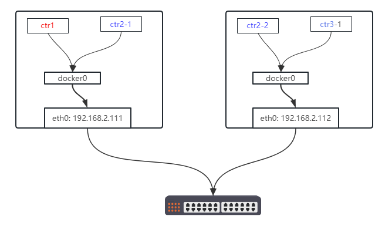
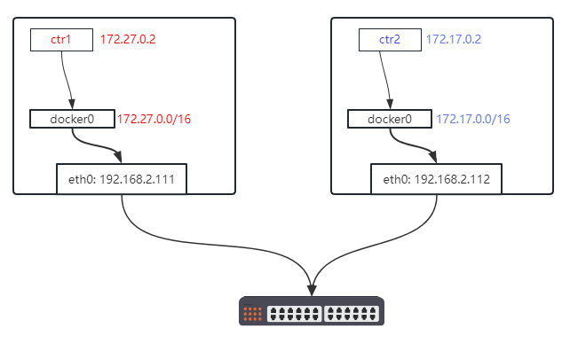
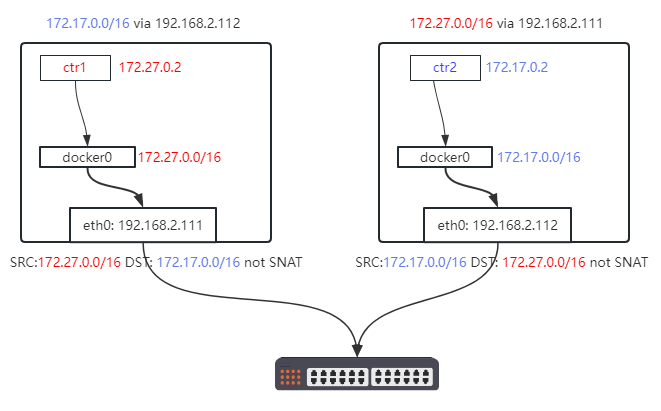
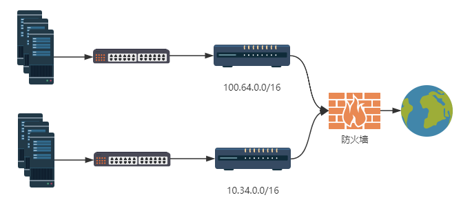
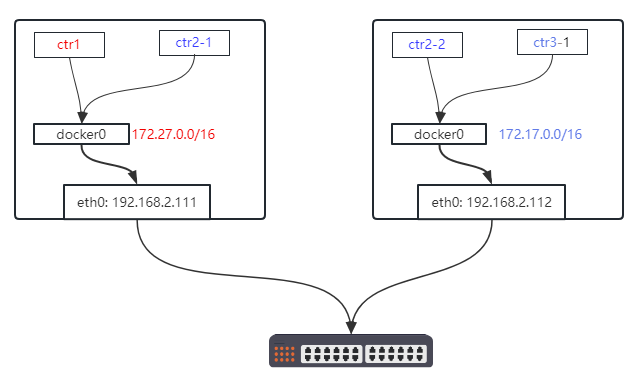

# 容器跨节点通信

## 介绍

单机 docker 的容器网络很好，但是生产里服务都部署在单机上就存在单点故障，通常是部署在多台机器上部署：



所以我们要解决容器跨节点的问题。假设在没有 K8S 下，如何来实现容器跨节点通信。

## 跨节点容器互通



跨节点互通的前提，因为容器 IP 都是 docker0 的 CIDR 下的，所以互通机器的 docker0 的网段要配置成不同，然后再考虑实现手段。

### 宿主机转发

```bash
# 192.168.2.112 上
$ ping 172.27.0.2
PING 172.27.0.2 (172.27.0.2) 56(84) bytes of data.
^C
--- 172.27.0.2 ping statistics ---
2 packets transmitted, 0 received, 100% packet loss, time 1005ms

# 192.168.2.111 上
$ ping 172.17.0.2
PING 172.17.0.2 (172.17.0.2) 56(84) bytes of data.
^C
--- 172.17.0.2 ping statistics ---
2 packets transmitted, 0 received, 100% packet loss, time 2024ms
```

直接是不通的，因为会走默认路由，走到网关，匹配到网关的默认路由，最后发到后续的设备被丢弃。

根据网络知识，我们知道只要不过网关出去，也就是二层网络内 IP 不会被 NAT，所以我们可以直接添加路由让 `172.27.0.0/16` 发往 `192.168.2.111` 机器上：

```bash
# 192.168.2.112 上
$ ip route add 172.27.0.0/16 via 192.168.2.111
$ ping -c1 172.27.0.2
PING 172.27.0.2 (172.27.0.2) 56(84) bytes of data.
64 bytes from 172.27.0.1: icmp_seq=1 ttl=64 time=0.274 ms

--- 172.27.0.2 ping statistics ---
1 packets transmitted, 1 received, 0% packet loss, time 0ms
rtt min/avg/max/mdev = 0.274/0.274/0.274/0.000 ms
```

没问题，然后我们在 `192.168.2.112` 上的容器内 ping 下：

```bash
# 192.168.2.112 上
$ docker exec -ti ctr2 ping 172.27.0.2
PING 172.27.0.2 (172.27.0.2): 56 data bytes
64 bytes from 172.27.0.2: seq=0 ttl=62 time=0.341 ms
64 bytes from 172.27.0.2: seq=1 ttl=62 time=0.394 ms
64 bytes from 172.27.0.2: seq=2 ttl=62 time=0.360 ms
64 bytes from 172.27.0.2: seq=3 ttl=62 time=0.494 ms
```

但是会有个问题，如果你 ping 的同时去 `192.168.2.111` 上抓包：

```bash
# 注意往右边拖动查看 IP
$ tcpdump -nn -e -i eth0 icmp 
tcpdump: verbose output suppressed, use -v or -vv for full protocol decode
listening on eth0, link-type EN10MB (Ethernet), capture size 262144 bytes
7e:bf:9c:27:f5:9e > 7e:10:5f:2f:f1:47, ethertype IPv4 (0x0800), length 98: 192.168.2.112 > 172.27.0.2: ICMP echo request, id 68, seq 42, length 64
7e:10:5f:2f:f1:47 > 7e:bf:9c:27:f5:9e, ethertype IPv4 (0x0800), length 98: 172.27.0.2 > 192.168.2.112: ICMP echo reply, id 68, seq 42, length 64
```

会发现来源 IP 是宿主机而并非容器的 IP，这是因为每个机器上都有 docker 配置的 SNAT。实际中，我们肯定希望一个节点上的容器访问另一个节点上的容器 IP 是不做 NAT 的，所以我们希望添加一个 iptables 规则跳过 docker 的 NAT iptables 规则，例如在 `192.168.2.112` 上：

- 来源 IP 172.17.0.0/16 + 目标 IP 是 172.27.0.0/16 的直接跳到走 `POSTROUTING` 的 `ACCEPT`

转换下就是在 `192.168.2.112` 上:

```
# 192.168.2.112 上
$ iptables -t nat -S POSTROUTING
-P POSTROUTING ACCEPT
-A POSTROUTING -s 172.17.0.0/16 ! -o docker0 -j MASQUERADE

# 添加规则，跳过 nat
$ iptables -w -t nat -I POSTROUTING -s 172.17.0.0/16 -d 172.27.0.0/16 -j RETURN
```

添加后我们在 `192.168.2.112` 上再 ping 目标容器 IP 会发现 ping 不通：

```bash
# 测试容器访问公网，不影响访问公网的 SNAT
$ docker exec -ti ctr2 ping -c 2 223.5.5.5
PING 223.5.5.5 (223.5.5.5): 56 data bytes
64 bytes from 223.5.5.5: seq=0 ttl=112 time=18.470 ms
64 bytes from 223.5.5.5: seq=1 ttl=112 time=18.881 ms

--- 223.5.5.5 ping statistics ---
2 packets transmitted, 2 packets received, 0% packet loss
round-trip min/avg/max = 18.470/18.675/18.881 ms

$ docker exec -ti ctr2 ping 172.27.0.2
PING 172.27.0.2 (172.27.0.2): 56 data bytes

```

然后我们在 `2.111` 上抓包，会发现：

```bash
$ tcpdump -nn  -i eth0 icmp 
tcpdump: verbose output suppressed, use -v or -vv for full protocol decode
listening on eth0, link-type EN10MB (Ethernet), capture size 262144 bytes
10:51:13.421797 IP 172.17.0.2 > 172.27.0.2: ICMP echo request, id 74, seq 72, length 64
10:51:13.421947 IP 172.27.0.2 > 172.17.0.2: ICMP echo reply, id 74, seq 72, length 64
```

来源 IP 是对的，没有 SNAT 了，容器也回包了，但是因为 `2.111` 上没有添加路由，所以 `27` 回包给 `17` 会走默认路由发到网关上。
> 请不要在一些底层使用 openstack 虚拟化的虚机上验证本部分，因为 openstack 的组件会对从虚机网卡发出去包的 MAC 地址和 IP 校验，此处的包的 MAC 地址是网卡的，但是 IP 地址不是网卡的 IP 地址，过不了校验会被扔掉

这里留个作业，请结合前面的 iptables 教程和本小结的知识，自行配置让两端容器互通。



### 结论

路由这种互通就是利用宿主机转发，也就是 flannel 的 `host-gw` 模式（自行去查看 iptables 规则，实际上是一个 16 位 CIDR 段，省去多条 iptables 规则），它没有对包做处理，比 vxlan、IPIP 做了隧道封装的效率高，缺点是只能在同一个二层网络内使用：



例如图里的大概网络 `100.64.100.0/24` 和机器 `10.13.178.0/24` 的有两台或者多台机器组了 K8S 节点，这个时候配置可不单单在 Linux 机器上添加路由就行了，而现实生活里，你更没有权限和能力在网络设备上去配置。

这里不介绍其他几种实现了，例如 etcd/consul + calico/flannel、 macvlan、ipvlan 来实现 docker 跨节点互通。

## 负载均衡

解决了 docker 容器跨节点互通，但是实际中不可能一个应用一个副本容器，也就是下面的情况：



例如 ctr1 要访问 ctr2 ，但是 ctr2 有两个副本，最常见的负载均衡就是四层均衡了，不用考虑上层的应用层数据，只要保证 TCP/UDP 数据发送到即可。所以我们希望实现：
- 访问 `ctr2-LB-IP:port` 负载到 `ctr2-1:port` 和 `ctr2-2:port`

实现思路是两个：
- iptables 实现，目标IP `ctr2-LB-IP` + 目标端口 port + 轮询 dnat 到 `ctr2-1:port` 和 `ctr2-2:port`
- lvs 实现这个负载均衡

这个就是 K8S service 的 `ClusterIP` 的实现思想，kube-apiserver 负责分配出 LB-IP（service IP），kube-proxy watch 到 service 添加创建，会在本机上新增 iptables 或者 lvs 规则，在 POD 会发生重建调度，kube-proxy 会更新负载均衡后端的 real server 信息。

## DNS

假设我们用 iptables 实现了负载均衡，`LB-IP` 肯定是动态分配的，ctr1 访问 ctr2 的 `LB-IP` 可以使用服务注册发现来适配动态 IP，但是这样负载均衡和应用耦合在一起了，如果某个应用需要 nginx 代理下，nginx 也部署多个副本，总不能魔改 nginx 加上服务注册发现 SDK。所以一个服务调用另一个服务都是用的域名（就像公有云上 RDS 实例，不用关注背后的实现），也就是 K8S 的 service name。

然后 DNS 也要多个副本，所以容器内的 dns server 会写指定的 DNS server 的 LB-IP，也就是 K8S 所有 POD 内：

```bash
$ grep nameserver /etc/resolv.conf
nameserver 10.96.0.10
```

## 总结

本章大概介绍下，从单节点衍生到多节点，需要解决很多场景问题，后续 K8S 很多组件和设计思想都是一样的。

## 链接

- [docker网络: container 网络](03.03.md)
- 下一部分: [K8S overlay 概念](04.01.md)
