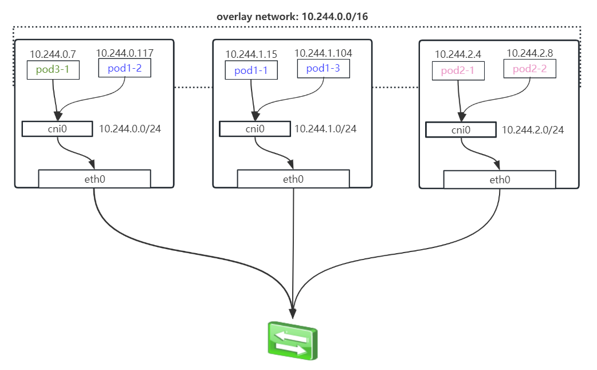

# 基础概念

此章节介绍一些基础概念，不做详细描述。

## K8S pod 网络

K8S 的网络如下，POD 的网络是 Overlay 网络，意思是在现有网络上构建一个网络。就像图里的，只有 K8S 节点才能访问 `10.244.0.0/16` 这个网络，其他机器访问就会走自己默认路由最后路由出去而不会进到 POD 网络。

而 `cni0` 是 K8S 的 CNI plugin 接口规范，容器运行时并不是只有 docker ，还有很多其他的容器运行时实现，要求 pod 的容器 veth 都挂在 cbr0 下而不限制在 docker0 下，也就是 `cni0` 网桥。

K8S 的 POD 就是 `>=1` 个的容器，先创建 pause 这个 sandbox 容器，然后其他的容器 `--net container:<pause_id>` 附加上去。

## 链接

- [docker 容器跨节点通信](03.04.md)
- 下一部分: [Service 工作原理](04.02.01.md)
