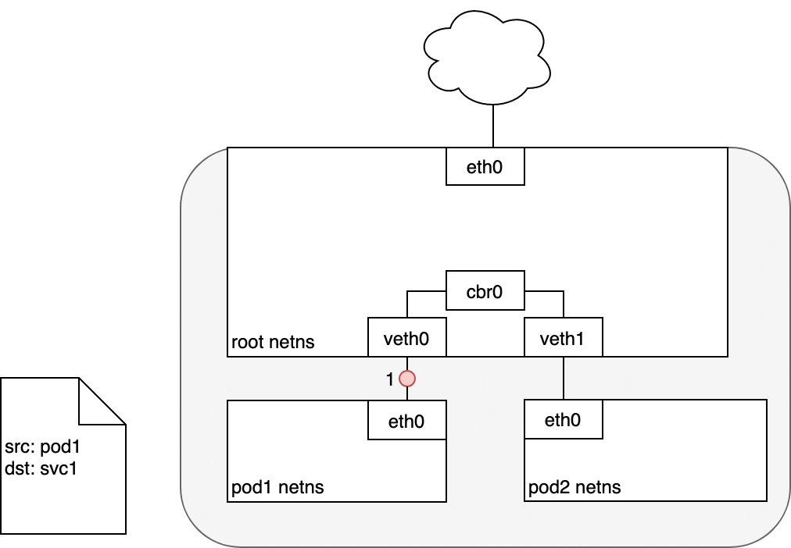
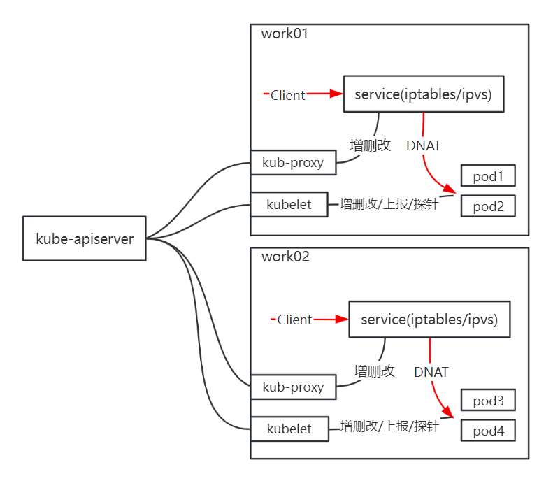

# Service 

## 工作原理

K8S Service 就是在节点上访问 `ServiceIP:ServicePort` DNAT 成应用真实副本 `POD_IP:POD_PORT` 就像下面：



而 K8S service 相关工作进程和大体工作流程如下：



- kubelet：增删改 POD ，并且对 POD 做探针请求，http、tcp、exec ，如果探针失败认为 POD 不健康，上报 kube-apiserver
- kube-proxy 监听到 POD 就绪、删除、不健康后，会更新到本节点上的 iptables/ipvs 规则

查看当前节点 kube-proxy 模式可以通过下面命令查看，iptables 和 ipvs 模式各有优缺点和 bug，按需选择。

```bash
$ curl localhost:10249/proxyMode
iptables
```

Service 虽然工作在内核态的四层（TCP/UDP/STCP）负载均衡，但是还是需要 IP 地址（因为是四层拦截，IP 不会被路由，所以 Service IP 也被称为虚拟 IP，VIP），官方一些教程默认的 CIDR 是 `10.96.0.0/12`，自行更改的话注意子网计算，例如 `10.95.0.0/12` 实际上是在 `10.80.0.0/12` 里，kube-apiserver 启动时候会创建 Service CIDR 第一个主机位的 IP 的 Service：

```bash
$ kubectl describe svc kubernetes
Name:              kubernetes
Namespace:         default
Labels:            component=apiserver
                   provider=kubernetes
Annotations:       <none>
Selector:          <none>
Type:              ClusterIP
IP Family Policy:  SingleStack
IP Families:       IPv4
IP:                10.96.0.1
IPs:               10.96.0.1
Port:              https  443/TCP
TargetPort:        6443/TCP
Endpoints:         192.168.2.111:6443,192.168.2.112:6443,192.168.2.113:6443
Session Affinity:  None
Events:            <none>
```

Service 后端是 Endpoints，而 Endpoint 的 IP 一般是 POD_IP 或者类似 kubernetes 这样的机器 IP ，以及如果你想创建类似把外部 IP 映射到内部的 service 域名，可以创建不指定 `selector` 的同名 service 和 endpoint。另外不一定要走 Service，很多服务有注册发现机制，把 `Pod_IP:Port` 注册上去，其他业务直接使用它来连接。

## 一些坑

- POD 访问自己的 service 会不通（特别是在一些其他人或者云上的 K8S 实例上），需要配置 cni0 为混杂模式或者 kubelet 配置 `hairpinMode`
- SVC 负载还得看应用层，比如 GRPC （基于 HTTP/2，只会一次 TCP 握手）会因为长连接而在 SVC 下不会均衡在每个 POD 上
- 每个节点最好安装 conntrack-tools 让有 conntrack 二进制命令，kube-proxy 会使用它做一些操作

## 链接

- [K8S overlay 概念](04.01.md)
- 下一部分: [iptables Service 模式](04.02.01.md)
