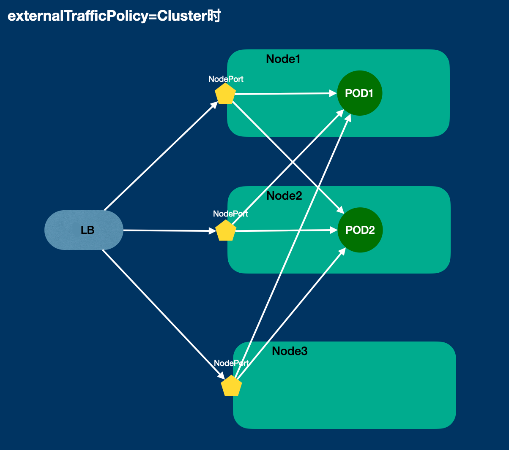
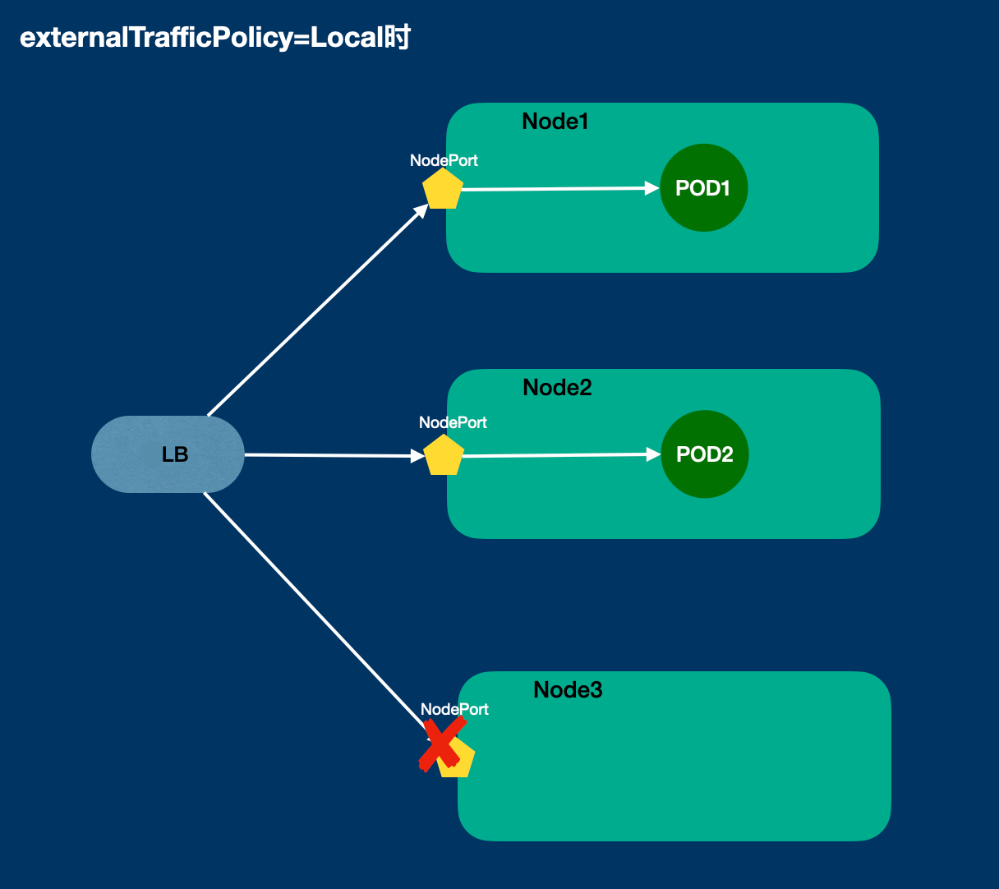

# NodePort

NodePort 和 docker -p 类似，但是新版本 kube-proxy（1.21.14,>=1.22.10.>=1.23.7，和模式无关）废弃掉了用户空间的 kube-proxy 监听端口代理，kube-proxy [>=1.26 增加 `--iptables-localhost-nodeports=true` 选项开关](https://github.com/kubernetes/kubernetes/commit/bef207003148dfe061672269003d4727afb5170c) 开启 `net.ipv4.conf.all.route_localnet=1` 来配合 iptables 做 DNAT
- https://github.com/kubernetes/kubernetes/issues/106713
- https://github.com/kubernetes/kubernetes/issues/100643
- 移除 kube-proxy 用户态端口监听 https://github.com/kubernetes/kubernetes/pull/108496
- https://github.com/kubernetes/kubernetes/issues/103860
- https://github.com/kubernetes/kubernetes/pull/112133/files

## SNAT 和 externalTrafficPolicy

默认 nodePort 的 `externalTrafficPolicy` 为 Cluster，流量如下：



如果节点上没有 Pod，则会被 DNAT 发往其他节点，但是此刻也做了 SNAT，pod 最终回复给本节点，本节点返回给 client。

## externalTrafficPolicy=Local

在 Cluster 的时候，如果本节点上没 pod，会发往对应节点做 SNAT 而丢失来源 IP：


如果不做 SNAT 就有问题：
1. 外部 Client 访问 `Node2:30001`，报文的源 IP 是外部 `Client IP`
2. Node2 转发过去，因为最终收到的报文内部的源 IP 是 `Client IP`，会走自己路由回包给 `CLient IP`，Client 就会很莫名其妙，我访问的是 `Node2:30001` ，你不是 Node2 给我回复干啥，这个就是无效的 TCP 报文，网络设备可能会扔掉或者内核协议栈会扔掉。
3. 避免这种就是要做 SNAT，Client 感知到的请求和响应报文始终是 `Node2:30001`

而 Local 模式就是解决因为 SNAT 而丢失源 IP 的问题，工作原理如下，本机上没 Pod 就会不通，有 Pod 就只发给本机 Pod，设置 `externalTrafficPolicy=Local` 以及配合 LB 的健康检查剔除掉没有 Pod 的节点：



## hostPort

和 NodePort 类似， nat 表的规则：

```bash
$ iptables -w -t nat -S | grep HOSTPORT
-A PREROUTING -m addrtype --dst-type LOCAL -j CNI-HOSTPORT-DNAT
...
```

但是后面是直接本机的 PodIP，毕竟它的属性是 Pod 上 `kubectl explain pod.spec.containers.ports.hostPort`。

## 链接

- [externalIPs](04.02.03.md)
- 下一部分: [探针和一些坑](04.04.md)
