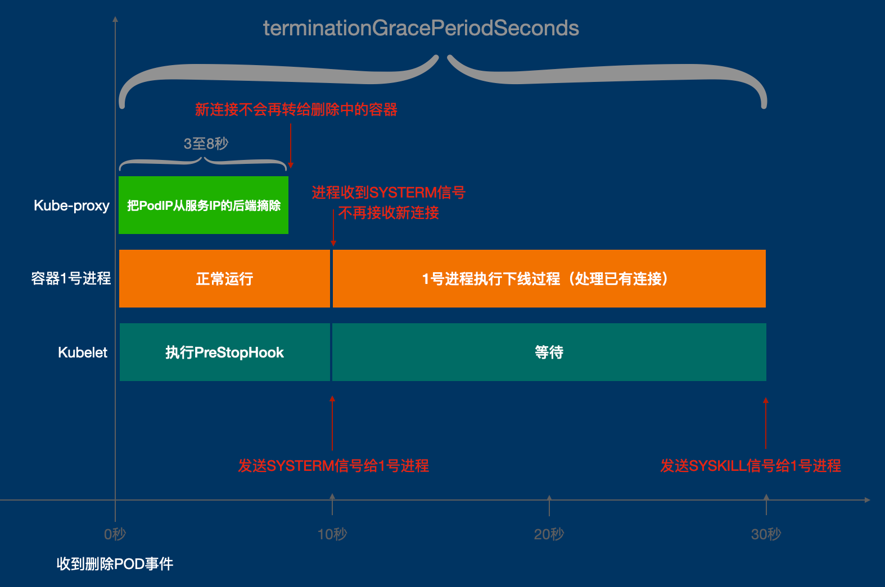

# 探针和一些坑

探针是本机上 kubelet 执行去探测本机上的 Pod 的，分为启动（Startup，>=1.17）、存活（Liveness）和就绪（Readiness）探针，当探针不正常时候，也可以手动对本机 Pod 发对应请求模拟排查。

## 一些坑

http 类型探针状态码要 [200<= code < 400](https://github.com/kubernetes/kubernetes/blob/49ff25507455cae99cb1b681a278db617ac979c1/pkg/probe/http/http.go#L111) ，一些应用如果没单独的 `/health` 免认证接口而出现 401 就会失败，并且 kubelet 的 http user-agent 为 `kube-probe/v{version}`。

### http 探针

启动一定要配置就绪探针，kubelet 执行就绪探针成功后，会 Update POD `status.conditions[][@type=Ready].status=true` 后，kube-proxy watch 到这个 event 才把 POD_IP 加入到 service 后面的 endpoint 里（否则滚动更新会 503），大多数人都配置的 http 探针，可能在一些老版本会遇到下面类似报错：

```
Readiness probe failed: Get "http://xxxx/health": context deadline exceeded (Client.Timeout exceeded while awaiting headers)
```

该问题大部分是因为 kubelet http 探测是起新的连接而没复用连接造成（建议升级到 >=1.27），其他原因和详细信息见：

- https://github.com/kubernetes/kubernetes/issues/89898
- https://github.com/kubernetes/kubernetes/issues/89898#issuecomment-1383207322

### 优雅停止

销毁Pod的流程:

1. kubelet 收到删除 Pod 的指令后，如果 Pod 有配置 PreStop Hook，则先执行 PreStop Hook，否则直接给 Pod 的 1 号进程发送 SYSTERM 信号
2. kube-proxy 也同时收到 Pod 的删除指令，从 Service 的后端中摘除这个待删除的 PodIP；这一步与第 1 步是并行进行的，由于集群中服务数量越来越多的缘故，kube-proxy 完成摘除 PodIP 这一步需要 3~8 秒钟，就是说最迟 8 秒后，向该 Pod 的 Service 发起新的连接不会发再到删除中的 Pod，在那之前仍然可能有新的连接到达，已经建立的连接不会受影响。
3. kubelet 等待至终止宽限期（`terminationGracePeriodSeconds`，默认为30秒）结束，Pod 一直没退出就给 Pod 的 1 号进程发送 SYSKILL 信号强制杀死。



如果 Pod 先退出，而 kube-proxy 晚摘掉 PodIP，则会有问题，所以需要 PreStopHook 来避免：
1. PreStop sleep 10s，然后完成的时候，PodIP 就不在 Service 后面了
2. 容器里的 Pid 1 的进程处理 SYSTEM 信号，由于不会有新的连接，退出之前还需要处理存量的连接
3. 对于副本数量很多的，不要使用百分比，例如 40 个设置 25% 会一次滚动下线 10 个，造成剩下 30 个会压力暴涨

## 链接

- [NodePort](04.03.md)
- 下一部分: [CNI 和 cni-plugins](04.05.md)
