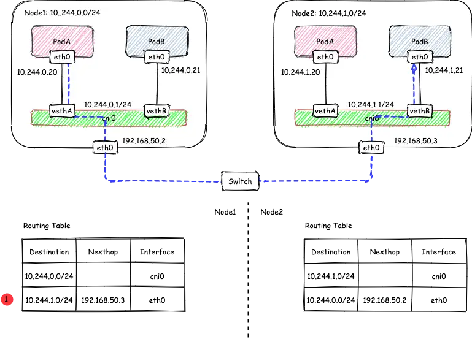
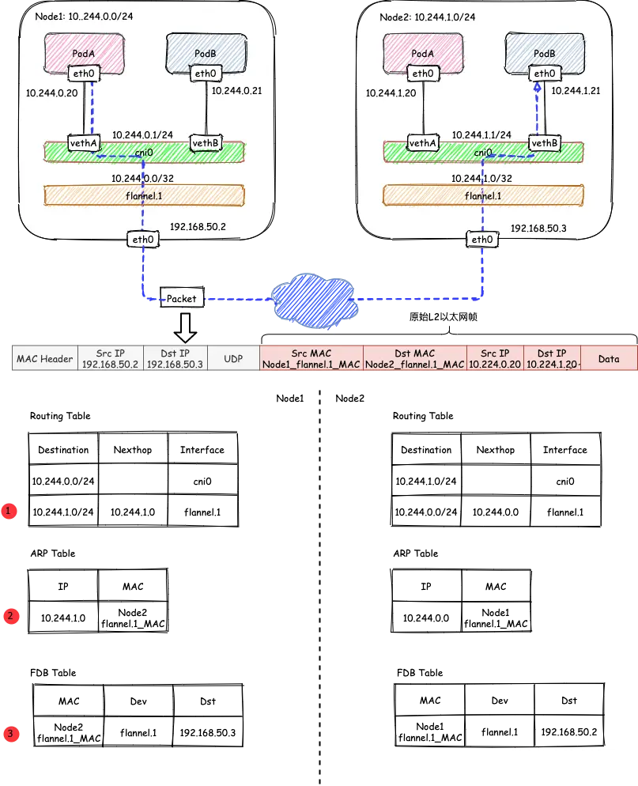
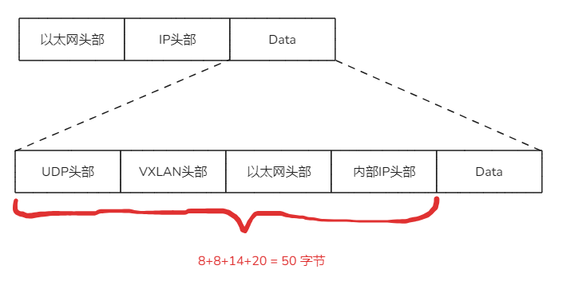

# flannel

flannel 是最简单的一款 CNI 实现了（缺点是不支持 NetworkPolicy），大多数都是使用 Linux 自带的能力和内核模块（并且就一个进程），先学会它搞懂基础，后面去学其他的 CNI 会有很多相似之处。

## 后端存储

支持 etcd v2 和 kubernetes API，etcd 只要不是非常老的版本都默认是 v3 API 存储了，而 etcd 官方不建议 v2 v3 数据共同存储，所以 K8S 部署都是使用后者（选项`--kube-subnet-mgr`）作为后端存储。

## 后端类型

- VXLAN：基于 UDP 转发二层报文的隧道协议
- host-gw：k8s 节点添加转发路由，局限在所有节点都在同一个二层才能使用。
- IPIP：IPIP 也是 Linux 的原生隧道方案之一，相比 VXLAN 功能更加精简，但是只支持 IPv4 单播流量
- WireGuard: 新内核（>=5.6）模块自带的协议，基于它隧道组网
- IPSec：是一种对 IP 协议进行加密和认证隧道协议
- 基于云服务的后端：AWS 、[AliVPC](AliCloud VPC Backend for Flannel) 、GCE
- UDP：一种自定义的，基于用户态 UDP 转发三层报文的隧道协议，不推荐使用。

最常见的是前面三个了。查看当前 flannel 模式可以通过每个节点上：

```
$ cat /run/flannel/subnet.env 
FLANNEL_NETWORK=10.244.0.0/16 # pod 的 overlay 网络
FLANNEL_SUBNET=10.244.0.1/24 # 当前节点分配到的 CIDR，默认是 kube-controller-manager 设置的 node-mask=24
FLANNEL_MTU=1450 # 网卡 MTU
FLANNEL_IPMASQ=true # 是否对 Pod 的流量开启 SNAT
```

配置来源于 configmap：

```bash
$ kubectl -n kube-system get cm kube-flannel-cfg -o yaml
apiVersion: v1
data:
  cni-conf.json: |
    {
      "name": "cbr0",
      "cniVersion": "0.3.1",
      "plugins": [
        {
          "type": "flannel",
          "delegate": {
            "hairpinMode": true,
            "isDefaultGateway": true
          }
        },
        {
          "type": "portmap",
          "capabilities": {
            "portMappings": true
          }
        }
      ]
    }
  net-conf.json: |
    {
      "Network": "10.244.0.0/16",
      "Backend": {
        "Type": "vxlan", #<----- 全局设置模式
        "Port": 8475
      }
    }
kind: ConfigMap
...
```

### host-gw 模式和 SNAT 规则



host-gw docker 跨节点的章节介绍了，此模式下 flanneld 进程本机添加路由转发到其他节点上，另外在在每个节点上添加类似的 iptables 规则，假设下面第一个节点的

```
$ iptables -t nat -S | grep FLANNEL
-N FLANNEL-POSTRTG
-A POSTROUTING -m comment --comment "flanneld masq" -j FLANNEL-POSTRTG
# kube-proxy 的 masq mark，这里防止重复 SNAT
-A FLANNEL-POSTRTG -m mark --mark 0x4000/0x4000 -m comment --comment "flanneld masq" -j RETURN
# 本机访问其他节点的 PodIP 不做 SNAT
-A FLANNEL-POSTRTG -s 10.244.0.0/24 -d 10.244.0.0/16 -m comment --comment "flanneld masq" -j RETURN
# 外部 Pod 访问本机 Pod 的不做 SNAT
-A FLANNEL-POSTRTG -s 10.244.0.0/16 -d 10.244.0.0/24 -m comment --comment "flanneld masq" -j RETURN
# 其他节点手动指定 本机Pod CIDR 到 node IP 的时候，不需要 SNAT
-A FLANNEL-POSTRTG ! -s 10.244.0.0/16 -d 10.244.0.0/24 -m comment --comment "flanneld masq" -j RETURN
# PodIP 访问外面（非组播地址），例如其他 nodeIP 和 公网 IP 做 SNAT，等同于 docker -p 桥接网络访问外面需要做 SNAT 
-A FLANNEL-POSTRTG -s 10.244.0.0/16 ! -d 224.0.0.0/4 -m comment --comment "flanneld masq" -j MASQUERADE
# 其他节点手动添加 集群POD CIDR 路由到本机上的时候，由于开了转发，此处做 SNAT 
-A FLANNEL-POSTRTG ! -s 10.244.0.0/16 -d 10.244.0.0/16 -m comment --comment "flanneld masq" -j MASQUERADE
```

一些遇到过的问题：

- [阿里云上使用flannel host-gw跨节点pod不通的解决](https://zhangguanzhang.github.io/2020/06/23/host-gw-in-aliyun/)
- 一些底层使用 openstack 虚机上 host-gw 会不通，因为 openstack 的组件会对从虚机网卡发出去包的 MAC 地址和 IP 校验，包的 MAC 地址是网卡的，但是 IP 地址不是网卡的 IP 地址，过不了校验会被扔掉


### flannel vxlan 模式

#### vxlan 原理

假设有两个节点 Node1 和 Node2，其中 Node1 的 PodA 要跟 Node2 的 PodB 通信，则它们之间的通信过程如下图所示：



整个过程：

- 发送端：在 PodA 中发起 `ping 10.244.1.21` ，ICMP 报文经过 cni0 网桥后走到宿主机的路由表，发现是发往 flannel.1 网卡，而该网卡是 VXLAN 类型的设备，内核会使用 flannel.1 网卡的配置信息负责 VXLAN 封包。 将原始 L2 报文封装成 VXLAN UDP 报文封装完后，封装成正常的二层三层报文，然后从 eth0 发送。
- 接收端：Node2 收到 UDP 报文，端口是 8472，发给本机的内核进程，内核根据信息查询到 flannel.1 的 VXLAN 信息而进行解包。根据解包后得到的原始报文中的目的 IP，将原始报文经由本机路由 cni0 发送给 PodB。

> 网上很多说 vxlan 封包解包并不是 flanneld 进程处理而是内核处理的，可以每个节点 `kill -STOP <flanneld_pid>` 后测试跨节点网络。

因为额外封装了，会有 50 字节开销，所以 [flanneld 源码会把 flanneld 的 mtu 剪掉 50](https://github.com/flannel-io/flannel/blob/bb077808679ff71527d5a9a0ff7ffbf7d108dad4/pkg/backend/vxlan/vxlan_network.go#L44)，就像俄罗斯套娃一样，想要把小的放到外面那层内部去，你必须限制 小的外面 <= 大的内部体积。


flannel.1 就是 vxlan 的 vtep （虚拟隧道端点），flanneld 进程会给 K8S 打上 annotation 写上自己的 MAC 地址：

```bash
$ kubectl get node -o yaml | grep flannel.alpha
      flannel.alpha.coreos.com/backend-data: '{"VNI":1,"VtepMAC":"02:2f:70:44:d7:3f"}'
      flannel.alpha.coreos.com/backend-type: vxlan
      flannel.alpha.coreos.com/kube-subnet-manager: "true"
      flannel.alpha.coreos.com/public-ip: 192.168.50.2
      flannel.alpha.coreos.com/backend-data: '{"VNI":1,"VtepMAC":"26:4a:e8:aa:01:d8"}'
      flannel.alpha.coreos.com/backend-type: vxlan
      flannel.alpha.coreos.com/kube-subnet-manager: "true"
      flannel.alpha.coreos.com/public-ip: 192.168.50.3
      flannel.alpha.coreos.com/backend-data: '{"VNI":1,"VtepMAC":"46:92:51:8e:a2:c9"}'
      flannel.alpha.coreos.com/backend-type: vxlan
      flannel.alpha.coreos.com/kube-subnet-manager: "true"
      flannel.alpha.coreos.com/public-ip: 192.168.50.4
$ ip link show flannel.1
50: flannel.1: <BROADCAST,MULTICAST,UP,LOWER_UP> mtu 1450 qdisc noqueue state UNKNOWN mode DEFAULT group default 
    link/ether 02:2f:70:44:d7:3f brd ff:ff:ff:ff:ff:ff
```

然后 flanneld 进程会从 K8S 获取其他节点的 flannel.1 MAC 地址和 `public-ip` :
- 维护自己的 L2 信息，让内核能以这个 mac 信息封装 vxlan 报文的 MAC 地址
- 维护 fdb 转发表（就是告诉内核发给其他 flannel 节点应该把 vxlan 后的报文以宿主机网络封装应该发往啥 IP 地址），不依赖实际宿主机 MAC 地址，所以可以跨三层。

```bash
$ ip neigh show dev flannel.1
10.244.2.0 lladdr 46:92:51:8e:a2:c9 PERMANENT
10.244.1.0 lladdr 26:4a:e8:aa:01:d8 PERMANENT
# 推荐使用绝对路径，特别是 cni-plugins 放到 PATH 里会执行成 cni-plugins 的 bridge 二进制了
$ /sbin/bridge fdb | grep flannel
26:4a:e8:aa:01:d8 dev flannel.1 dst 192.168.50.3 self permanent
46:92:51:8e:a2:c9 dev flannel.1 dst 192.168.50.4 self permanent
$ cat /run/flannel/subnet.env 
FLANNEL_NETWORK=10.244.0.0/16
FLANNEL_SUBNET=10.244.0.1/24
FLANNEL_MTU=1450
FLANNEL_IPMASQ=true
```

#### 一些 tips

在云上跨 VPC 部署 flannel 的时候，需要设置 flanneld 的 `-public-ip`, k3s 则是 `--flannel-external-ip`，或者 `kubectl edit node` 改 Annotations。

udp 没有放行，例如一些云虚拟化上，可以部署之前 nc 测下 8472 udp 收发包：

```bash
# server
nc -l -u 8472

# client
nc -u <dest_public_ip> 8472
```

或者看下 flannel.1 状态，例如 `RX` 接收为 0 说明收不到其他节点发送的，通常是 udp 没放行：

```bash
$ ip -s a s flannel.1
....
RX: bytes  packets  errors  dropped overrun mcast   
    0          0        0       0       0       0 
```

跨主机能 ping 通但是上层应用层协议不通（例如 curl 其他节点 Pod 的 url），一般是虚拟化网络层面被处理了，例如下面两个问题：

- 深信服的 超融合 和 aCloud 虚拟化平台会使用 `8472/udp` ，见文章 [记一次K8S VXLAN Overlay网络8472端口冲突问题的排查](https://cloud.tencent.com/developer/article/1746944)，需要修改 flannel 端口。
- 非 8472 端口的 flannel 见文章 [https://zhangguanzhang.github.io/2022/07/28/redhat84-vxlan-esxi/](https://zhangguanzhang.github.io/2022/07/28/redhat84-vxlan-esxi/)

### IPIP 模式

和 vxlan 类似，`Type: ipip` 网卡名是 `flannel.ipip`，内部 vxlan 换成 IP 报文，而 IP 头部是 20 字节，所以网卡 MTU `1500-20=1480`：

```bash
$ ip r s 
default via 192.168.50.1 dev eth0 proto static 
192.168.50.0/24 dev eth0 proto kernel scope link src 192.168.50.2
10.244.1.0/24 via 192.168.50.3 dev flannel.ipip onlink 
10.244.2.0/24 via 192.168.50.4 dev flannel.ipip onlink 
10.244.0.0/24 dev cni0 proto kernel scope link src 10.244.0.1 
$ cat /run/flannel/subnet.env 
FLANNEL_NETWORK=10.244.0.0/16
FLANNEL_SUBNET=10.244.0.1/24
FLANNEL_MTU=1480
FLANNEL_IPMASQ=true
$ ip -d a s flannel.ipip
102: flannel.ipip@NONE: <NOARP,UP,LOWER_UP> mtu 1480 qdisc noqueue state UNKNOWN group default 
    link/ipip 192.168.50.2 brd 0.0.0.0 promiscuity 0 minmtu 0 maxmtu 0 
    ipip any remote any local 192.168.50.2 ttl inherit nopmtudisc numtxqueues 1 numrxqueues 1 gso_max_size 65536 gso_max_segs 65535 
    inet 10.244.0.0/32 scope global flannel.ipip
       valid_lft forever preferred_lft forever
    inet6 fe80::5efe:a0d:5bd4/64 scope link 
       valid_lft forever preferred_lft forever
```

抓包，因为是套娃，不像 vxlan 直接抓 udp 端口过滤就行，是 IP 报文套 IP 报文，所以抓包比较麻烦，过滤条件看第二层 IP 报文的源目 IP hex 对比，例如本机 ping 另一个节点 PodIP `10.187.0.14` [在线转换成 hex](https://www.browserling.com/tools/ip-to-hex) 是 `0x0abb000e`:

```bash
$ tcpdump -nn -i ens160 'ip[32:4] = 0x0abb000e   or ip[36:4] = 0x0abb000e' -w ipip.pcap
tcpdump: listening on ens160, link-type EN10MB (Ethernet), capture size 262144 bytes
^C13 packets captured
26 packets received by filter
0 packets dropped by kernel
```

宿主机 IP 打码了，可以看到右边套娃了一层 IP 协议：

```bash
$ tcpdump -nn -r ipip.pcap 
reading from file ipip.pcap, link-type EN10MB (Ethernet)
16:31:16.668984 IP xx.xx.xx.212 > xx.xx.xx.213: IP 10.187.2.0.62435 > 10.187.0.14.53: Flags [P.], seq 3040765315:3040765386, ack 1650546132, win 501, options [nop,nop,TS val 950814887 ecr 2423449147], length 71 43526+ [1au] AAAA? etcd3.default.default.svc.cluster2.local. (69) (ipip-proto-4)
16:31:16.669352 IP xx.xx.xx.213 > xx.xx.xx.212: IP 10.187.0.14.53 > 10.187.2.0.62435: Flags [P.], seq 1:168, ack 71, win 502, options [nop,nop,TS val 2423457143 ecr 950814887], length 167 43526 NXDomain*- 0/1/1 (165) (ipip-proto-4)
16:31:16.669391 IP xx.xx.xx.212 > xx.xx.xx.213: IP 10.187.2.0.62435 > 10.187.0.14.53: Flags [.], ack 168, win 501, options [nop,nop,TS val 950814888 ecr 2423457143], length 0 (ipip-proto-4)
16:31:16.669738 IP xx.xx.xx.212 > xx.xx.xx.213: IP 10.187.2.0.62435 > 10.187.0.14.53: Flags [P.], seq 71:134, ack 168, win 501, options [nop,nop,TS val 950814888 ecr 2423457143], length 63 49916+ [1au] AAAA? etcd3.default.svc.cluster2.local. (61) (ipip-proto-4)
16:31:16.670012 IP xx.xx.xx.213 > xx.xx.xx.212: IP 10.187.0.14.53 > 10.187.2.0.62435: Flags [P.], seq 168:327, ack 134, win 502, options [nop,nop,TS val 2423457144 ecr 950814888], length 159 49916*- 0/1/1 (157) (ipip-proto-4)
16:31:16.670031 IP xx.xx.xx.212 > xx.xx.xx.213: IP 10.187.2.0.62435 > 10.187.0.14.53: Flags [.], ack 327, win 501, options [nop,nop,TS val 950814888 ecr 2423457144], length 0 (ipip-proto-4)
16:31:16.672805 IP xx.xx.xx.212 > xx.xx.xx.213: IP 10.187.2.0.62435 > 10.187.0.14.53: Flags [P.], seq 134:205, ack 327, win 501, options [nop,nop,TS val 950814891 ecr 2423457144], length 71 63476+ [1au] A? etcd2.default.default.svc.cluster2.local. (69) (ipip-proto-4)
16:31:16.673063 IP xx.xx.xx.213 > xx.xx.xx.212: IP 10.187.0.14.53 > 10.187.2.0.62435: Flags [P.], seq 327:494, ack 205, win 502, options [nop,nop,TS val 2423457147 ecr 950814891], length 167 63476 NXDomain*- 0/1/1 (165) (ipip-proto-4)
16:31:16.673084 IP xx.xx.xx.212 > xx.xx.xx.213: IP 10.187.2.0.62435 > 10.187.0.14.53: Flags [.], ack 494, win 501, options [nop,nop,TS val 950814892 ecr 2423457147], length 0 (ipip-proto-4)
16:31:21.156396 IP xx.xx.xx.212 > xx.xx.xx.213: IP 10.187.2.0 > 10.187.0.14: ICMP echo request, id 10, seq 1, length 64 (ipip-proto-4)
16:31:21.156626 IP xx.xx.xx.213 > xx.xx.xx.212: IP 10.187.0.14 > 10.187.2.0: ICMP echo reply, id 10, seq 1, length 64 (ipip-proto-4)
16:31:22.178953 IP xx.xx.xx.212 > xx.xx.xx.213: IP 10.187.2.0 > 10.187.0.14: ICMP echo request, id 10, seq 2, length 64 (ipip-proto-4)
16:31:22.179206 IP xx.xx.xx.213 > xx.xx.xx.212: IP 10.187.0.14 > 10.187.2.0: ICMP echo reply, id 10, seq 2, length 64 (ipip-proto-4)
```

## 一些其他信息

flannel 支持设置 `"Directrouting": true` 来让二层节点走 host-gw，三层走 vxlan/IPIP 模式，flanneld 进程存在意义是节点增删改查维护本机配置，你也可以不用 CNI，自己写脚本 ip 命令配置实现，说这个是帮助你。

### flannel 和 cni-plugins 相关

kube-controller-manager 设置了：`allocate-node-cidrs` 和 `cluster-cidr` 参数时，kube-controller-manager 会为每个 node 确定 pod ip 范围：

```
--node-cidr-mask-size-ipv4=24
```

默认 IPv4 掩码是 24位，意味着每个节点最多 253 个 Pod （0，1，255 IP 不使用）。


flanneld 刚启动时，在 `RegisterNetwork` (调用 `kubeSubnetManager.AcquireLease`) 中获取当前 node 的 `Spec.PodCIDR`，并把需要的一些信息写入到 node 的 `annotation`。

子网信息再写入到 `/run/flannel/subnet.env` （main.WriteSubnetFile），由 flannel CNI 读取，用于分配 pod ip。


bridge 二进制第一次运行的时候会在 node 上生成一个 Linux bridge 设备（非 hostNetwork 的 Pod 调度上来时候），默认名字是 cni0。这个 bridge 就是一个虚拟交换机，新生成的 pod 网卡会通过 veth 设备连接到这个 bridge 上面。

bridge 每次被调用的时候，会给 pod 创建 veth，将 veth 连接到 cni0，并且调用 `host-local` 从本机 subnet 中分配 ip。

几个跟 flannel CNI 有关的文件或目录：

- `/etc/cni/net.d/10-flannel.conf` flannel CNI 的配置文件。
- `/var/lib/cni/flannel` 这个目录下放的是 flannel 每次调用 bridge 用到的配置，文件名是 `io.kubernetes.sandbox.id` （通过 `docker inspect [container id]` 可以看到）。
- `/var/lib/cni/networks/cbr0` 这个目录下放的是 `host-local` CNI 分配的 IP，文件名为分配的容器 IP（主机位递增），文件内容为 `io.kubernetes.sandbox.id` 。

## 图片参考

- https://juejin.cn/post/6994825163757846565

## 链接

- [CNI 和 cni-plugins](04.05.md)
- 下一部分: [CNI calico](04.07.md)
