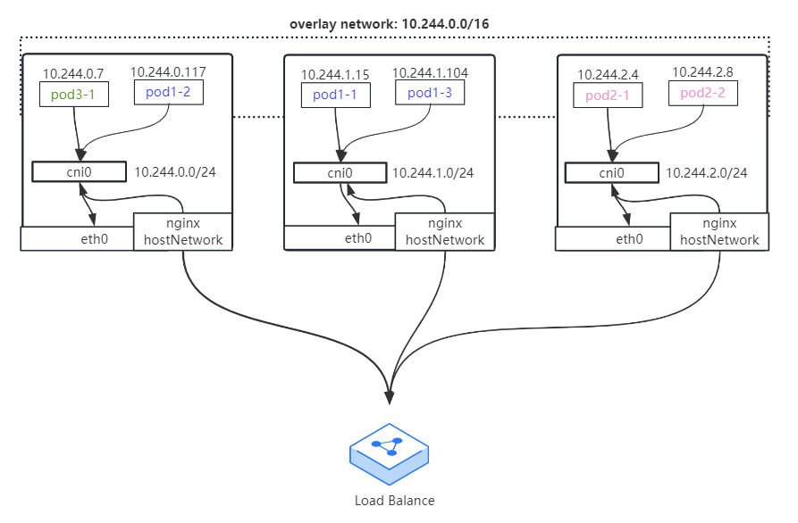

# Ingress Controller

Ingress Controller 是一个统称，并不只有一个，例如：

 * [Ingress NGINX](https://github.com/kubernetes/ingress-nginx): Kubernetes 官方维护的方案，基于 nginx 实现。
 * [Nginx Ingress](https://docs.nginx.com/nginx-ingress-controller/): nginx 官方实现的。
 * [F5 BIG-IP Controller](https://clouddocs.f5.com/containers/latest/): F5 所开发的 Controller，它能够让管理员通过 CLI 或 API 让 Kubernetes 与 OpenShift 管理 F5 BIG-IP 设备。
 * [Ingress Kong](https://konghq.com/blog/kubernetes-ingress-controller-for-kong/): 著名的开源 API Gateway 方案所维护的 Kubernetes Ingress Controller。
 * [Traefik](https://github.com/containous/traefik)>: 是一套开源的 Golang 实现的 HTTP 反向代理与负载均衡器，而它也支持 Ingress。
 * [haproxy-ingress](https://haproxy-ingress.github.io/docs/getting-started/): 一套以 HAProxy 为底的 Ingress Controller。
 * [Cilium Gateway](https://haproxy-ingress.github.io/docs/getting-started/): 基于 Cilium 网关和 eBPF 技术构建的高级 Ingress 控制器。
 * [Envoy Gateway](https://gateway.envoyproxy.io/zh/): 基于 Envoy 代理的入口控制器，用于路由和管理外部流量.
 * [Higress](https://higress.io/en/): Higress 是基于阿里内部多年的 Envoy Gateway 实践沉淀，以开源 Istio 与 Envoy 为核心构建的云原生 API 网关。

> * 而 Ingress Controller 的实现不只上面这些方案,还有很多可以在网络上找到这里不一一列出来了

## 怎么暴漏多个 http 服务

现实生活中，大部分流量都是 http ，而通常情况下 K8S 的 Overlay 网络是 K8S 节点才能访问的，例如 PodIP 是 `10.224.1.198`，非 K8S worker 访问这个 IP 路由到自己网关，然后网关路由出去，也就是无法访问到 PodIP，这个和 vmware workstation 的 nat 网络虚拟机一样，你局域网内其他机器无法访问你 vmware 上的虚机。

假设有两个 Service 需要映射出去：
- `account-user` 对外成 `/userInfo` web 路由
- `book-server` 对外成 `/bookList` web 路由

### 反向代理

你第一时间想到的是 node 上跑个 nginx 反向代理 Service：



nginx 写配置文件， resolver 写 coredns SVC_IP：

```
http {
    resolver 10.96.0.10 valid=5s;

    server {
        listen 80;

        location /userInfo {
            proxy_pass http://account-user.prod.svc.cluster.local;
            proxy_set_header Host $host;
            proxy_set_header X-Real-IP $remote_addr;
            proxy_set_header X-Forwarded-For $proxy_add_x_forwarded_for;
            proxy_set_header X-Forwarded-Proto $scheme;
        }

        location /bookList {
            proxy_pass http://book-server.prod.svc.cluster.local;
            proxy_set_header Host $host;
            proxy_set_header X-Real-IP $remote_addr;
            proxy_set_header X-Forwarded-For $proxy_add_x_forwarded_for;
            proxy_set_header X-Forwarded-Proto $scheme;
        }
    }
}
```

### 优化

后面你意识到这样每次都是走 Service，能否 `proxy_pass` 写的是 service 名字，lua 去请求 `https://kubernetes.default.svc.cluster.local` 把 PodIP 维护在 upstream 列表里。

### annotation

再后面，你意识到写文件非常繁琐，不知道哪些 Service 被代理了，你意识到 k8s 有 `annotation` 这个东西，能够在这里写注释自己 nginx + lua 读取，你可能写到 svc 的 `annotation` 上。也就是下面类似：

```
apiVersion: v1
kind: Service
metadata:
  annotations:
    conf:|
      more_set_headers "Request-Id: $req_id";
      ...
  ...
```

nginx + lua 连接 kube-apiserver，获取所有 Service 的 `annotation` 生成配置文件。

### CRD 和 Ingress Controller 工作原理

随着你对 k8s 的 api 越来越熟悉，意识到写 svc 上似乎太繁琐，这样不方便 kubectl 增删改查，可不可以创建自己的资源对象，类似 `Kind: Pod` 那样有 `kind: Proxy`，实际上这就是 `Kind: ingress` 由来。把反向代理配置文件抽象成 K8S 的 yaml 配置：

```yaml
# 这里是举例，不保证时效性
apiVersion: networking.k8s.io/v1
kind: Ingress
metadata:
  name: my-ingress
  annotations:
    nginx.ingress.kubernetes.io/proxy-body-size: "0"
    nginx.ingress.kubernetes.io/proxy-read-timeout: "600"
    nginx.ingress.kubernetes.io/proxy-send-timeout: "600"
spec:
  ingressClassName: nginx
  rules:
  - host: api.domain.com
    http:
      paths:
      - backend:
          serviceName: api
          servicePort: 80
  - host: test.domain.com
    http:
      paths:
      - path: /web/*
        backend:
          serviceName: web
          servicePort: 8080
  - host: backoffice.domain.com
    http:
      paths:
      - backend:
          serviceName: backoffice
          servicePort: 8080     
```

例如访问到 Ingress Controller 的 http 流量:
- `curl -H 'host: api.domain.com' http://<ingress-controller-SLB_IP>` 会反向代理到 api 这个 service 后的 Pod 的 80 端口
- `curl -H 'host: test.domain.com' http://<ingress-controller-SLB_IP>/web/v1` 会反向代理到 web 这个 service 后的 Pod 的 8080 端口
- `curl -H 'host: backoffice.domain.com' http://<ingress-controller-SLB_IP>` 会反向代理到 backoffice 这个 service 后的 Pod 的 8080 端口

也就是和 nginx 反向代理类似，如果你进入到 ingress nginx 内，会发现上面的 Ingress 最终还是在容器内生成 nginx 配置文件：

```bash
$ kubectl -n ingress-nginx exec nginx-ingress-controller-6cdcfd8ff9-t5sxl -- cat /etc/nginx/nginx.conf
...
	## start server nginx.testdomain.com
	server {
		server_name nginx.testdomain.com ;
		
		listen 80;
		
		set $proxy_upstream_name "-";
		
		location / {
			
			set $namespace      "default";
			set $ingress_name   "nginx-ingress";
			set $service_name   "nginx";
			set $service_port   "80";
			set $location_path  "/";
            ........
	## end server nginx.testdomain.com      
...
```

要注意的一点是虽然写的是反向代理 service 名字，但是实际是直接反向代理到 service 的 endpoint 上的。

### 高可用

网络方面：

- Ingress Controller 使用 NodePort 对接外部 SLB
- hostNetwork 下对接外部 SLB，例如需要代理 TCP 流量
- hostPort 对接外部 SLB

```
                                            +-------+
                                            |       |
                               -+---------->+       |
                              /             +-------+ node1
                             /    
                            /     
                           /                +-------+
+--------+                /                 |       |
| client +----------->   SLB -------------->+       |
+--------+                \                 +-------+ node2
                           \    
                            \     
                             \              +-------+
                              ------------->+       |
                                            |       |
                                            +-------+ node3
```


部署方式：
- daemonSet + nodeSeletor
- deploy设置replicas数量 + nodeSeletor + pod互斥

多个 `Ingres Controller`（注意 ingress yaml 的 `ingressClassName`）：

```
                                            +---------------------------+
                                            |                           |
                               -+---------->+ hostNetwork的ingress nginx|
                              /             +---------------------------+ node1
                             /    
                            /     
                           /                +---------------------------+
+--------+                /                 |                           |
| client +----------->    F5 -------------->+ hostNetwork的ingress nginx|
+--------+                \                 +---------------------------+ node1
                           \    
                            \     
                             \              +---------------------------+
                              ------------->+hostNetwork的ingress nginx |
                                            |                           |
                                            +---------------------------+ node3

                                            +---------------------------+
                                            |                           |
                               -+---------->+ hostNetwork的Higress      |
                              /             +---------------------------+ node4
                             /    
                            /     
                           /                +---------------------------+
+--------+                /                 |                           |
| client +-----------> SLB(or VIP) -------->+ hostNetwork的Higress      |
+--------+                \                 +---------------------------+ node5
                           \    
                            \     
                             \              +---------------------------+
                              ------------->+ hostNetwork的Higress      |
                                            |                           |
                                            +---------------------------+ node6

```

## 链接

- [K8S 高可用和 SLB 相关](04.09.md)
- 下一部分: [案例: calico-kube-controllers 日志报错 dial tcp 10.96.0.1:443: i/o timeout](05.01.md)
