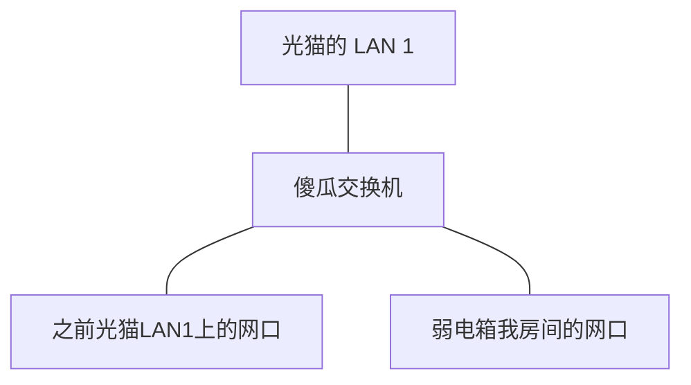

# 搬家后有线无法上网

最近搬家后，发现房间网口插上路由器无网。

## 排查

路由系统设置里给主机名 op 字样改了因为 dhcp 会默认发送主机名啥的，发现还是不行，ping 光猫 IP 和打开光猫网页都可以，无法 ping 通公网 IP。
查看光猫背后的密码登录进去是普通权限无法设置啥的。
然后换常规路由器的 wan 接墙上的网口还是一样，然后直接去弱电箱，电脑的网口接光猫的 lan 口，发现一样。
后面向房东要来宽带师傅号码，打过去说了下我的排查过程，师傅说光猫的 1 和 3 口子才行，2 和 4 是 iptv 电视用的就给挂了。问题是 1 和 3 已经有人接线了，如果自己家里的宽带，可以尝试整下超管密码改光猫的这种口子限制，但是这是别人的，要是没整好就挨骂了。所以剩下办法就是整个百兆或者千兆的傻瓜交换机了：

