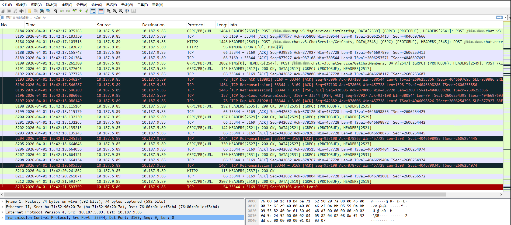
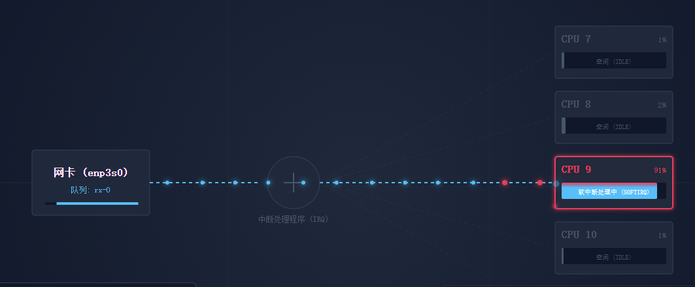
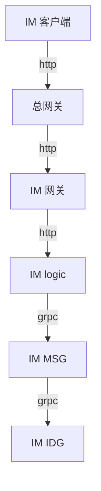
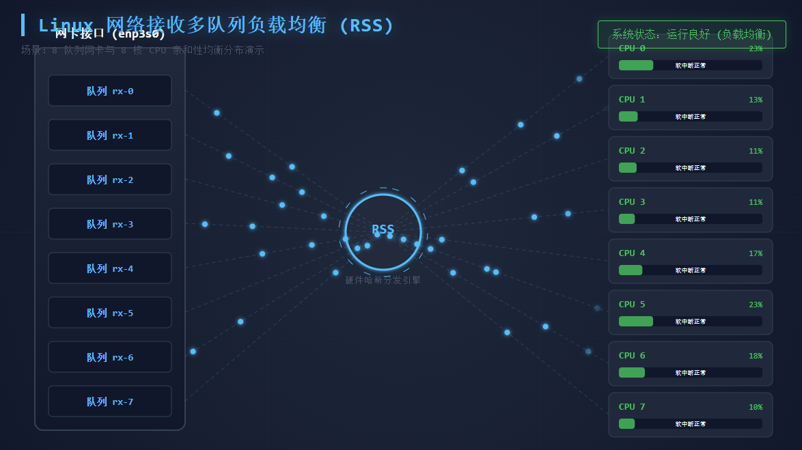
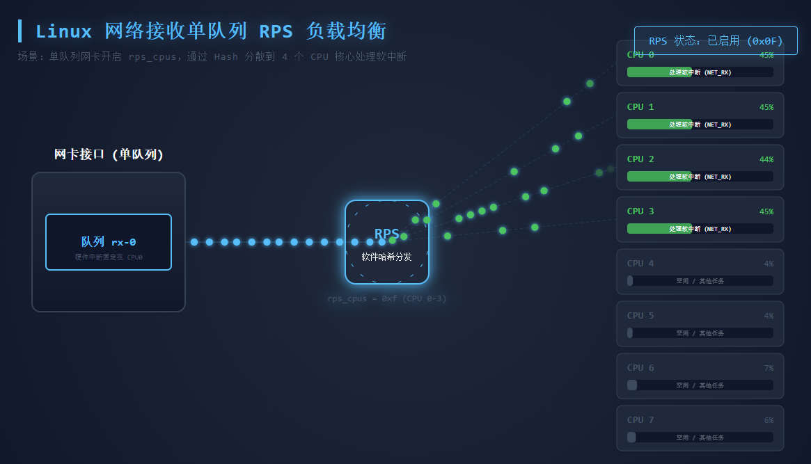

## 环境信息

完整吐槽版见 [K8S IM 服务高峰期频繁 tcp timeout](https://zhangguanzhang.github.io/2026/04/06/k8s-vm-im-timeout/)

k8s: 
- version: `1.27.16`
- CNI: flannel vxlan
- Pod CIDR：`10.187.0.0/16`
docker: 26.1.4
os: `Kylin Linux Advanced Server V10 (Tercek)`
kernel: `4.19.90-23.50.v2101.ky10.aarch64`

客户环境完全内网，无法远程，不允许执行 sudo 和切到 root，需要执行啥 root 命令和抓包都要输出相关步骤给客户，客户反馈给他们的云平台的人执行。

## 故障现象描述

客户去年采购我们服务，然后客户公司的云平台提供了 arm64 鲲鹏虚拟化上的 Kylin 虚机，然后我们实施去部署，整体是部署 K8S 后再部署 IM 业务。
今年2月份开始，IM 服务在白天高峰期使用期间频繁消息发不出去，就是类似微信那样消息发送失败，然后消息左侧有个红色圈，点它重试发送，或者消息转圈很久才发送出去。
客户反馈去年没这个现象，今年2月份中附近开始频繁出现，已经严重影响使用，使用人数没有增加，为啥开始频繁出现，初步让现场实施根据 IM 研发指导查对应服务日志，IM 服务日志里频繁出现 grpc 报错 `connenction timed out`

## 出差排查

安排我和一个 IM 服务研发出差去客户现场排查，总体大致人群：
- 我司人员有 3-4 人在现场，我和 IM 研发为主
- 客户的 pm 和部分技术人员
- 客户的云平台人员

### 初步排查

03/30 IM 研发到场，IM 研发组在出差之前让现场根据他们代码逻辑搜了下日志，找到了 grpc 的报错：

```golang
// https://github.com/grpc/grpc-go/blob/v1.60.1/internal/transport/http2_client.go#L1571
func (t *http2Client) reader(errCh chan<- error) {
	defer close(t.readerDone)

	if err := t.readServerPreface(); err != nil {
		errCh <- err
		return
	}
	close(errCh)
	if t.keepaliveEnabled {
		atomic.StoreInt64(&t.lastRead, time.Now().UnixNano())
	}

	// loop to keep reading incoming messages on this transport.
	for {
		t.controlBuf.throttle()
		frame, err := t.framer.fr.ReadFrame()
		if t.keepaliveEnabled {
			atomic.StoreInt64(&t.lastRead, time.Now().UnixNano())
		}
		if err != nil {
			// Abort an active stream if the http2.Framer returns a
			// http2.StreamError. This can happen only if the server's response
			// is malformed http2.
			if se, ok := err.(http2.StreamError); ok {
				t.mu.Lock()
				s := t.activeStreams[se.StreamID]
				t.mu.Unlock()
				if s != nil {
					// use error detail to provide better err message
					code := http2ErrConvTab[se.Code]
					errorDetail := t.framer.fr.ErrorDetail()
					var msg string
					if errorDetail != nil {
						msg = errorDetail.Error()
					} else {
						msg = "received invalid frame"
					}
					t.closeStream(s, status.Error(code, msg), true, http2.ErrCodeProtocol, status.New(code, msg), nil, false)
				}
				continue
			} else {
				// Transport error.
				t.Close(connectionErrorf(true, err, "error reading from server: %v", err))
				return
			}
		}
```

是服务调用 grpc read 报错了 `error reading from server: read tcp 10.187.6.94:54034 -> 10.187.9.85:3169: read: connection timed out`，从 grpc 逻辑看，这个不是 grpc 应用层，而是下层网络层出现的问题。

后面搜关键字 `error reading from server` 发现 IM 服务涉及到作为 grpc 客户端的服务都会白天业务高峰期随机打这个报错，根据 trace-id 搜索日志，发现服务日志上下文出现了以下：
- 作为 http `i/o timeout` 的 `Post \"http://....\": dial tcp 10.96.x.x:80 i/o timeout`
- 作为 redis 客户端的 `read tcp 10.187.x.xx:43823 -> host_ip:6379: i/o timeout`

查看 Prometheus 监控均无丢包：

```
# 两天跨度
irate(node_network_receive_drop_total[5m]) 数据为0
rate(node_network_transmit_drop_total[5m]) 0-0.0033波动
rate(node_network_receive_errs_total[5m]) 一直为0
rate(node_network_transmit_errs_total[5m]) 一直为0
rate(node_netstat_TcpExt_ListenOverflows[5m]) 数值基本为0，每天只有个别尖刺为1
rate(node_netstat_TcpExt_ListenDrops[5m]) 数值基本为0，每天只有个别尖刺为1
```

并且监控上看 conntrack 条目都没达到 max，系统日志 kernel 和 dmesg 均无异常。

现场服务分布是 IM 服务在其中的八台节点上面，然后让客户找 3-4 台迁移到同一个虚拟化宿的主机上，客户说不支持。

### 抓包

由于无法调整节点虚机分布情况，03/31 号就想着抓下包看看。选择一个最频繁的 IM 服务，抓它作为 grpc 客户端访问另一个 IM 服务的情况：

```shell
timeout 15m tcpdump -nn -i cni0 host and 10.187.5.89 and port 3169 -w 21.41-10.187.5.89-port3169.pcap
```

因为 K8S 的 Pod 容器的 veth 都是挂在 cni0 下的，所以抓 cni0 和限制端口，3169 是另一个服务的 grpc server 端口。抓完后，搜这个 5.89 的 grpc client 容器日志 `error reading from server` 找它作为客户端时候端口数字，然后抓包文件在 wireshark 里过滤，最后找到了对应的：



过滤后的 pcap 文件使用 tcpdump 转换下

```shell
$ tcpdump -nn -r xxx.pcap > grpc.txt
$ cat grpc.txt
...
15:42:16.983236 IP 10.187.5.89.33344 > 10.187.9.85.3169: Flags [P.], seq 936445:937108, ack 877897, win 3576, options [nop,nop,TS val 4046697723 ecr 2606253242], length 663
15:42:17.075246 IP 10.187.9.85.3169 > 10.187.5.89.33344: Flags [.], ack 935375, win 2973, options [nop,nop,TS val 2606253385 ecr 4046697578], length 0
15:42:17.075265 IP 10.187.5.89.33344 > 10.187.9.85.3169: Flags [.], seq 937108:938506, ack 877897, win 3576, options [nop,nop,TS val 4046697815 ecr 2606253385], length 1398
15:42:17.103330 IP 10.187.9.85.3169 > 10.187.5.89.33344: Flags [.], ack 935800, win 2973, options [nop,nop,TS val 2606253413 ecr 4046697666], length 0
15:42:17.103516 IP 10.187.5.89.33344 > 10.187.9.85.3169: Flags [P.], seq 938506:939886, ack 877897, win 3576, options [nop,nop,TS val 4046697843 ecr 2606253413], length 1380
15:42:17.103679 IP 10.187.9.85.3169 > 10.187.5.89.33344: Flags [P.], seq 877897:877927, ack 935800, win 2973, options [nop,nop,TS val 2606253413 ecr 4046697666], length 30
15:42:17.155748 IP 10.187.5.89.33344 > 10.187.9.85.3169: Flags [.], ack 877927, win 3576, options [nop,nop,TS val 4046697895 ecr 2606253413], length 0
15:42:17.261364 IP 10.187.9.85.3169 > 10.187.5.89.33344: Flags [.], ack 937108, win 2973, options [nop,nop,TS val 2606253571 ecr 4046697693], length 0
15:42:17.261380 IP 10.187.5.89.33344 > 10.187.9.85.3169: Flags [.], seq 939886:942682, ack 877927, win 3576, options [nop,nop,TS val 4046698001 ecr 2606253571], length 2796
15:42:17.377646 IP 10.187.9.85.3169 > 10.187.5.89.33344: Flags [P.], seq 877927:878006, ack 937108, win 2973, options [nop,nop,TS val 2606253687 ecr 4046697693], length 79
15:42:17.377728 IP 10.187.5.89.33344 > 10.187.9.85.3169: Flags [.], ack 878006, win 3576, options [nop,nop,TS val 4046698117 ecr 2606253687], length 0
15:42:17.546274 IP 10.187.9.85.3169 > 10.187.5.89.33344: Flags [.], ack 937108, win 2973, options [nop,nop,TS val 2606253856 ecr 4046697693,nop,nop,sack 1 {939886:942682}], length 0
15:42:17.546287 IP 10.187.5.89.33344 > 10.187.9.85.3169: Flags [.], seq 937108:938506, ack 878006, win 3576, options [nop,nop,TS val 4046698286 ecr 2606253856], length 1398
15:42:17.546289 IP 10.187.5.89.33344 > 10.187.9.85.3169: Flags [P.], seq 938506:939886, ack 878006, win 3576, options [nop,nop,TS val 4046698286 ecr 2606253856], length 1380
15:42:18.086062 IP 10.187.9.85.3169 > 10.187.5.89.33344: Flags [P.], seq 877927:878006, ack 937108, win 2973, options [nop,nop,TS val 2606254395 ecr 4046697693,nop,nop,sack 1 {939886:942682}], length 79
15:42:18.086149 IP 10.187.5.89.33344 > 10.187.9.85.3169: Flags [.], ack 878006, win 3576, options [nop,nop,TS val 4046698826 ecr 2606254395,nop,nop,sack 1 {877927:878006}], length 0
15:42:18.115164 IP 10.187.9.85.3169 > 10.187.5.89.33344: Flags [P.], seq 878006:878120, ack 937108, win 2973, options [nop,nop,TS val 2606254425 ecr 4046697693,nop,nop,sack 1 {939886:942682}], length 114
15:42:18.115179 IP 10.187.5.89.33344 > 10.187.9.85.3169: Flags [.], ack 878120, win 3576, options [nop,nop,TS val 4046698855 ecr 2606254425], length 0
15:42:18.132230 IP 10.187.9.85.3169 > 10.187.5.89.33344: Flags [P.], seq 878120:878199, ack 937108, win 2973, options [nop,nop,TS val 2606254442 ecr 4046697693,nop,nop,sack 1 {939886:942682}], length 79
15:42:18.132265 IP 10.187.5.89.33344 > 10.187.9.85.3169: Flags [.], ack 878199, win 3576, options [nop,nop,TS val 4046698872 ecr 2606254442], length 0
15:42:18.135213 IP 10.187.9.85.3169 > 10.187.5.89.33344: Flags [P.], seq 878199:878263, ack 937108, win 2973, options [nop,nop,TS val 2606254445 ecr 4046697693,nop,nop,sack 1 {939886:942682}], length 64
15:42:18.135245 IP 10.187.5.89.33344 > 10.187.9.85.3169: Flags [.], ack 878263, win 3576, options [nop,nop,TS val 4046698875 ecr 2606254445], length 0
15:42:18.245356 IP 10.187.5.89.33344 > 10.187.9.85.3169: Flags [.], seq 937108:938506, ack 878263, win 3576, options [nop,nop,TS val 4046698985 ecr 2606254445], length 1398
15:42:18.664046 IP 10.187.9.85.3169 > 10.187.5.89.33344: Flags [P.], seq 878263:878515, ack 937108, win 2973, options [nop,nop,TS val 2606254974 ecr 4046697693,nop,nop,sack 1 {939886:942682}], length 252
15:42:18.664056 IP 10.187.5.89.33344 > 10.187.9.85.3169: Flags [.], ack 878515, win 3576, options [nop,nop,TS val 4046699404 ecr 2606254974], length 0
15:42:18.664121 IP 10.187.9.85.3169 > 10.187.5.89.33344: Flags [P.], seq 878515:878767, ack 937108, win 2973, options [nop,nop,TS val 2606254974 ecr 4046697693,nop,nop,sack 1 {939886:942682}], length 252
15:42:18.664134 IP 10.187.5.89.33344 > 10.187.9.85.3169: Flags [.], ack 878767, win 3576, options [nop,nop,TS val 4046699404 ecr 2606254974], length 0
15:42:19.605358 IP 10.187.5.89.33344 > 10.187.9.85.3169: Flags [.], seq 937108:938506, ack 878767, win 3576, options [nop,nop,TS val 4046700345 ecr 2606254974], length 1398
15:42:20.261862 IP 10.187.9.85.3169 > 10.187.5.89.33344: Flags [P.], seq 878767:878804, ack 937108, win 2973, options [nop,nop,TS val 2606256572 ecr 4046697693,nop,nop,sack 1 {939886:942682}], length 37
15:42:20.261871 IP 10.187.5.89.33344 > 10.187.9.85.3169: Flags [.], ack 878804, win 3576, options [nop,nop,TS val 4046701001 ecr 2606256572], length 0
15:42:21.593744 IP 10.187.9.85.3169 > 10.187.5.89.33344: Flags [P.], seq 878804:881233, ack 937108, win 2973, options [nop,nop,TS val 2606257904 ecr 4046697693,nop,nop,sack 1 {939886:942682}], length 2429
15:42:21.593759 IP 10.187.5.89.33344 > 10.187.9.85.3169: Flags [R], seq 820483431, win 0, length 0
```

可以看到 sack hole `ack 937108 sack {939886:942682}` 说服务端收到了后面的 `939886:942682`，但还在等前面的 `937108:939886`。由于监控查看了网卡没有丢包 drop，可能发生在队列、qdisc、conntrack、overlay、虚拟网卡、软中断、对端内核处理慢、中间 NAT/SLB 等位置。

期间客户不愿意迁移虚机，就让我们调整服务分布：
- grpc client 和 server 的 Pod 到同一个节点
- 相关 Pod 重启调整副本到其他节点上啥的
- 某个服务副本数量调整

让我们各种配合折腾，然后出现了某个他们认为不合理的现象，晚上开会让我们解释，服务太多了而且是网状调用，我感觉解释没啥意义。

### 进一步分析

在开会沟通的时候，客户有个人员反馈在白天业务高峰期长 ping 了下节点 IP 发现丢包，结合前面监控和都是 client 角色的 tcp 连接出现，而且 IM 节点机器都在同一个二层，感觉更像是软中断造成。当场离开会议室，去客户测试环境上用 iperf3 压测了下确实复现了。

然后第二天白天客户上班时间，查看了下节点监控，白天的时候业务高峰期 CPU 负载都普遍 70%-80%，使用 mpstat 看下：

```shell
$ mpstat -P ALL 1
...
15时:05分:01秒  CPU    %usr   %nice    %sys %iowait    %irq   %soft  %steal  %guest  %gnice   %idle
15时:05分:02秒  all   32.95    0.00   21.46    0.00    1.40   25.40    0.00    0.00    0.00   18.79
15时:05分:02秒    0   26.32    0.00   45.45    0.00    1.01   21.21    0.00    0.00    0.00    6.06
15时:05分:02秒    1   33.98    0.00   23.30    0.00    0.97   23.30    0.00    0.00    0.00   18.45
15时:05分:02秒    2   40.00    0.00   20.00    0.00    7.00   21.00    0.00    0.00    0.00   12.00
15时:05分:02秒    3   22.92    0.00   19.79    0.00    1.04   20.83    0.00    0.00    0.00   35.42
15时:05分:02秒    4   23.00    0.00   12.00    0.00    1.00   27.00    0.00    0.00    0.00   37.00
15时:05分:02秒    5   24.51    0.00   25.49    0.00    0.98   27.45    0.00    0.00    0.00   21.57
15时:05分:02秒    6   21.98    0.00   21.98    0.00    3.30   16.48    0.00    0.00    0.00   36.26
15时:05分:02秒    7   25.51    0.00   22.45    0.00    0.00   31.63    0.00    0.00    0.00   20.41
15时:05分:02秒    8   34.38    0.00   22.92    0.00    1.04   21.88    0.00    0.00    0.00   19.79
15时:05分:02秒    9    3.09    0.00    4.12    0.00    1.03   91.75    0.00    0.00    0.00    0.00
15时:05分:02秒   10   26.26    0.00   30.30    0.00    1.01   22.22    0.00    0.00    0.00   20.20
15时:05分:02秒   11   66.67    0.00   16.16    0.00    1.01    9.09    0.00    0.00    0.00    7.07
15时:05分:02秒   12   87.88    0.00    7.07    0.00    0.00    5.05    0.00    0.00    0.00    0.00
15时:05分:02秒   13   26.73    0.00   27.72    0.00    0.99   29.70    0.00    0.00    0.00   14.85
15时:05分:02秒   14   26.53    0.00   22.45    0.00    1.02   22.45    0.00    0.00    0.00   27.55
15时:05分:02秒   14   36.08    0.00   21.65    0.00    1.03   15.46    0.00    0.00    0.00   25.77
^C
```

CPU9 的软中断太高了，网卡收包软中断可以通过 Linux 的 [softnet_stat](https://insights-core.readthedocs.io/en/latest/shared_parsers_catalog/softnet_stat.html) 查看：

```shell
$ awk '{for (i=1; i<=NF; i++) printf strtonum("0x" $i) (i==NF?"\n":" ")}' /proc/net/softnet_stat | column -t
1938196764  0     64045  0  0  0  0  0  0  0  0  0  0
4102185009  0     62016  0  0  0  0  0  0  0  0  0  0
2617098581  0     60736  0  0  0  0  0  0  0  0  0  0
1981260274  0     61325  0  0  0  0  0  0  0  0  0  0
2030547761  0     61382  0  0  0  0  0  0  0  0  0  0
3711414160  0     66266  0  0  0  0  0  0  0  0  0  0
1912023011  0     60173  0  0  0  0  0  0  0  0  0  0
1205738633  0     60451  0  0  0  0  0  0  0  0  0  0
4206669130  0     49669  0  0  0  0  0  0  0  0  0  0
3091698373  0     85583  0  0  0  0  0  0  0  0  0  0
967669351   0     51121  0  0  0  0  0  0  0  0  0  0
1147484404  0     54033  0  0  0  0  0  0  0  0  0  0
3309583543  0     50007  0  0  0  0  0  0  0  0  0  0
3025071012  0     57034  0  0  0  0  0  0  0  0  0  0
2015253678  0     56725  0  0  0  0  0  0  0  0  0  0
4257427908  0     68121  0  0  0  0  0  0  0  0  0  0
$ grep -E 'CPU|virtio.+(in|out)put' /proc/interrupts
           CPU0       CPU1       CPU2       CPU3       CPU4       CPU5       CPU6       CPU7       CPU8       CPU9       CPU10       CPU11       CPU12       CPU13       CPU14       CPU15
 98:      23713      34466      39165      25040     114273      49758      27276      70459          0 2075005390           0      152774       15573       93013      125418       93070    ITS-MSI 1572865 Edge   virtio3-input.0    
 99:          0          0          0          0          1          0          0          0          0  184847131           0           0           0           0           0           0    ITS-MSI 1572866 Edge   virtio3-output.0   
...

$ ip a s | grep enp3
2: enp3s0: <BROADCAST,MULTICAST,UP,LOWER_UP> mtu 1500 qdisc fq_codel state UP group default qlen 1000
    inet xxx.x.xx.xx/24 brd xxx.x.xx.xxx scope global enp3s0
$ cat /proc/irq/98/smp_affinity
00000000,00000000,00000000,00000200
cat /proc/irq/98/smp_affinity_list
9
```

### 结论

可以看到 cpu softirq 在 CPU9 上很高，而 `/proc/net/softnet_stat` 分析：

第二列（dropped）为0，softnet_stat 第三列(time_squeeze)里为不0：
• 每轮 softirq 有处理预算（时间/包数），内核规定一次软中断最多处理 `netdev_budget` 个包（默认 300），或最多运行 2 个 jiffies（约 2ms），没处理完就被调度器打断，下次再来
• 若时间 / 包数到了，队列里还有没处理完的包，就会 `time_squeeze++`
然后👆 `/proc/interrupts` 里看到 `virtio3-input` 在 CPU9 上中断太多了，而 `virtio3` 对应业务网卡 `enp3s0`， 说明 cpu 在处理网卡包的时候软中断太多。

不是：
• ❌ backlog 太小（否则 `/proc/net/softnet_stat` 第2列会涨），并且客户的 `backlog` 不是默认的 `1000` 而是 `8000`
• ❌ ring buffer 溢出（通常会伴随 drop）
• ❌ 纯网络丢包

从这些信息来看：

```shell
流量进入网卡
   ↓
集中打到单核 CPU（IRQ/RSS 不均）
   ↓
softirq 来不及及时处理（time_squeeze 增长）
   ↓
包没有丢，但“排队延迟”变大
   ↓
TCP ACK / 数据包延迟
   ↓
应用等待超时（read timeout）
   ↓
应用主动关闭连接 → 发送 RST
```



询问了下研发，发消息的 IM 大概调用链如下



为啥只有 grpc 报错，应该也有 http 的，然后 IM 服务研发告诉我 IM 服务的 http client 封装的有重试逻辑，然后在 loki 里搜 IM 服务的 retry 关键字搜了下确实也有不少。然后不筛选 IM 服务搜 http 的 `Client.Timeout` 发现也有其他业务组的超时。因为消息需要大量鉴权和判断用户组和权限啥的，所以 IM 服务都是用 grpc 长链接互相调用，避免多次 http 调用产生的开销，而长连接最容易收到影响，例如开头提到的 redis client 也报错了。

## 解决方案

单 CPU 处理网络 I/O 存在瓶颈下，可以使用网卡多队列提高性能。

通常情况下, 每张网卡有一个队列(queue), 所有收到的包从这个队列入, 内核从这个队列里取数据处理. 该队列其实是 ring buffer(环形队列), 内核如果取数据不及时, 则会存在丢包的情况.
一个CPU处理一个队列的数据, 这个叫中断。默认是cpu0(第一个CPU)处理。一旦流量特别大, 这个 CPU 负载很高, 性能存在瓶颈。所以网卡开发了多队列功能, 即一个网卡有多个队列, 收到的包根据 TCP 四元组信息 hash 后放入其中一个队列, 后面该链接的所有包都放入该队列。每个队列对应不同的中断, 使用 irqbalance 将不同的中断绑定到不同的核。充分利用了多核并行处理特性。提高了效率。

### RSS

目前是单队列到单个 CPU 上，而 Linux 有 RSS 硬件层面解决



但是机器是虚拟机，网上很多网络优化文章都是物理机下使用的，`ethtool -x eth0` 啥的都无法使用或者信息缺少和不支持，需要虚拟化上调整 virsh xml：

```xml
<model type='virtio'/>
<driver name='vhost' queues='8'/> #新增
```

开启后会消耗主机更多的虚拟化域 CPU/内存资源，即与虚拟机共享主机上的 CPU/内存资源，单个虚拟机因网卡多队列导致额外的资源占用为：按1个虚拟机3个网卡来算，每个网卡8队列深度2048，会占用24个vhost线程，高负载极端情况下占用480MB内存（队列深度为2048，假设平均报文长度为10KB，则一个vhost-net线程最多因缓存报文占用20MB内存）；空载情况下占用的内存消耗可以忽略。开启后可以虚机内通过：

```shell
$ ethtool -l enp3s0
Channel parameters for ens18:
Pre-set maximums:
RX:		0
TX:		0
Other:		0
Combined:	1
Current hardware settings:
RX:		0
TX:		0
Other:		0
Combined:	8 <---
```

但是客户的虚拟化云平台组不让变更，说要是给虚拟化整崩了咋整。

### RPS

然后就看系统层面有无解决办法，然后使用 Linux 的 RPS 了。RSS（工作在网卡的硬件层） 和 RPS（工作在 Linux 内核的软件层） 的目的都是把数据包分散到更多的 CPU 上进行处理，使得系统有更强的网络包处理能力。在把数据包分散到各个 CPU 时，保证了同一个数据流在一个 CPU 上，这样就可以减少包的乱序。

iperf3 压测复现，在客户的测试环境使用找4台机器：

```shell
# 机器1起两个server端口
iperf3 -s -p 5201
iperf3 -s -p 5202

# 机器2和机器3 访问机器1
iperf3 -c <m1_ip> -u -p 5201 -b 200M -l 128 -t 60
iperf3 -c <m1_ip> -u -p 5201 -b 200M -l 128 -t 60

#机器4 上ping机器1
ping <m1_ip>
```

iperf3 的 Lost/Total 列和压测期间ping统计信息都可以直观看到丢包，然后尝试配置：

```shell
# 调整 rps_cpus 为4个核心，f的二进制为1111代表4个核心，需要sudo或者root下执行
echo f > /sys/class/net/enp3s0/queues/rx-0/rps_cpus
```

然后同样步骤 iperf3 压测发现 ping 都不会丢包，并且查看 cpu 软中断不会集中到一个核心上。



客户生产环境所有机器最小为 16C，所有机器的 rps_cpu 可以先配置4个核心不会太激进。其次客户是虚拟机，不是有 NUMA 的物理机，有 NUMA 给核心绑定的同时没有配置cpu亲和性的话会导致 cpu 跨 NUMA 而增加耗时，所以在虚拟机上这个方案没问题，客户问我虚拟化崩了咋整，我说调整虚拟机的内核参数给虚拟化整崩了那云平台那帮人不应该去找鲲鹏虚拟化的人理论吗。后面说这个变更要写方案和走流程审批。

持久化，上面是 echo，机器重启就无了，可以用 systemd：

```shell
cat > /etc/systemd/system/set-rps.service << EOF
[Unit]
Description=Set RPS CPU mask for enp3s0
After=network.target

[Service]
Type=oneshot
ExecStart=/bin/sh -c 'echo f > /sys/class/net/enp3s0/queues/rx-0/rps_cpus'
RemainAfterExit=yes

[Install]
WantedBy=multi-user.target
EOF
```

但是怕别人给 systemd 这个 unit 禁止了，使用 udev：

```shell
cat > /etc/udev/rules.d/99-rps.rules << EOF
ACTION=="add", SUBSYSTEM=="net", KERNEL=="enp3s0", RUN+="/bin/sh -c 'echo f > /sys/class/net/%k/queues/rx-0/rps_cpus'"
EOF
udevadm control --reload-rules
udevadm trigger
```

或者 `NetworkManager dispatcher`:

```shell
cat > /etc/NetworkManager/dispatcher.d/rps << EOF
#!/bin/bash

if [ "$1" = "enp3s0" ] && [ "$2" = "up" ]; then
    echo f > /sys/class/net/enp3s0/queues/rx-0/rps_cpus
fi
EOF
```

对于 node_exporter 相关采集是没有开启的，需要调整下

```golang
// https://github.com/prometheus/node_exporter/blob/v1.8.2/collector/interrupts_common.go#L31
func init() {
	registerCollector("interrupts", defaultDisabled, NewInterruptsCollector)
}
```

同理还有 `softirqs`，发现 softnet 开启了，但是没做 grafana 指标。

## 反思

在排查过程中，明明我们写了现场排查记录的云文档，后面来的人不仔细看，就来问现场某些监控数据和内核参数和命令，又是重复的浪费时间。

监控我们做了监控回放，但是客户监控数据很大，导出两天都很久，然后又是老版本，发到办公室的同事重放失败和慢，新版本又换了监控 agent 和指标。私有化就是这样，不像 toC 那样只有自己环境一个最新版本，很多客户现场是老版本而且不愿意升级。

内核参数这块我记得以前三四年前配合麒麟找一个问题原因，麒麟让执行某个命令是收集 /proc /sys 目录下每个文件打包成压缩包，但是同事找了下麒麟的最新对接人，他说没这种。我记得以前整过一次的，哎，算了。

由于 /proc /sys 下存在部分文件一直有内容产生的，直接 tar 打包成压缩包不现实，谷歌搜了下类似需求发现有 `sos_report` 命令，然后后面出差回来在华为云上开了按时计费的鲲鹏机器，发现 sos_report 会检查 os-release 直接报错不支持的系统，查看了下鲲鹏的相关参数：

```shell
$ sysctl -a |& grep -E 'net.core. .mem_max|net.ipv4.udp_mem|net.core.netdev_build|rps_'
net.core.netdev_budget = 300
net.core.netdev_budget_usecs = 8000
net.core.rmem_max = 212992
net.core.rps_sock_flow_entries =16384
net.core.wmem_max = 212992
net.ipv4.udp_mem = 1527822 2037098 3855644
```

开了一个 arm64 的 CentOS 还是啥系统来着，发现能收集到，但是解开看了下缺数据：

```shell
/root/sosreport-ecs-3dda-2026-04-08-yhycnjr/sys/class/net/eth0
[root@gz eth0]# ls -l
total 8
-rw-r--r-- 1 root root    7 Apr  8 11:03 flags
drwxr-xr-x 2 root root 4096 Apr  8 11:03 statistics
```

## 参考

- [redhat 调优网络性能](https://docs.redhat.com/zh-cn/documentation/red_hat_enterprise_linux/8/html/monitoring_and_managing_system_status_and_performance/tuning-the-network-performance_monitoring-and-managing-system-status-and-performance)
- [redhat 配置 RPS 和 RFS](https://docs.redhat.com/zh-cn/documentation/red_hat_enterprise_linux/7/html/performance_tuning_guide/sect-red_hat_enterprise_linux-performance_tuning_guide-networking-configuration_tools#sect-Red_Hat_Enterprise_Linux-Performance_Tuning_Guide-Configuration_tools-Configuring_Receive_Packet_Steering_RPS)
- [Redis 高负载下的中断优化](https://tech.meituan.com/2018/03/16/redis-high-concurrency-optimization.html)
- [一个包从网卡到用户态的完整旅程](https://quant67.com/post/k8s-network/01-linux-network-stack/linux-network-stack.html)
